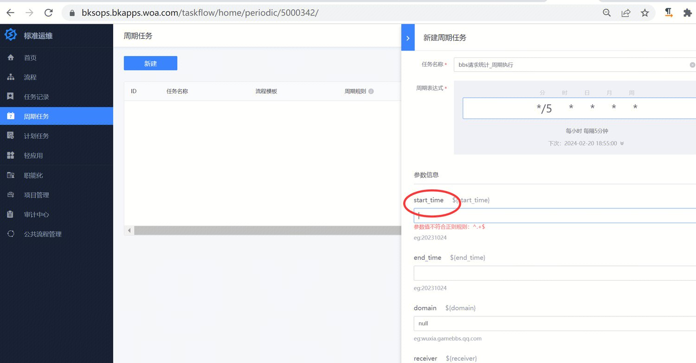

[toc]

# 现象描述

- 周期任务的start_time字段想自动获取此刻时间

#问题定位及处理

- 该周期任务，是跟进您的任务流程来获取参数，要想该字段可以自动获取时间，需要自己创建一个时间变量，把引用star-time的地方改成引用这个时间变量

易事厅链接：https://zhiyan.woa.com/servicedesk/detail/2715550?proj_id=27&module=41