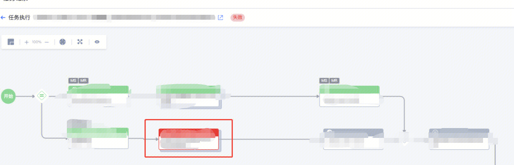

背景：

红框里父流程报错了，现在想要直接跳过父流程

<1>需要标准运维开发同学后台配置

<2>先给用户发这个开启后的功能差异，给用户确认，用户确认无误后再来标准运维开发同学操作

功能差异

目前独立子任务和非独立子任务的主要区别，也基本都源于两者执行机制的不同，区别有：

非独立子任务节点不支持完整重试或跳过，独立子任务支持。

非独立子任务能够继承根任务的系统变量和流程相关配置，如任务开始时间、执行代理人、通知方式等，独立子任务则会以子任务执行时的对应值为准。

非独立子任务与根任务是一对一的关系，独立子任务与根任务可能是多对一的关系。

非独立子任务的子任务在创建根任务时即确定，独立子任务则是在执行到对应节点时创建出对应的任务才确定。

非独立子任务如果暂停流转，则根任务也无法流转；独立子任务如果暂停流传，则根任务可以正常流转。

非独立子任务与根任务共享相同的任务 id 和 url；独立子任务则是不同的任务 id 和 url，在接口查询任务状态时返回数据有差异。

在任务层面，两者的任务数据记录方式完全不同，对于直接用任务树数据进行渲染的上层系统会出现问题。

开启后的功能差异声明

