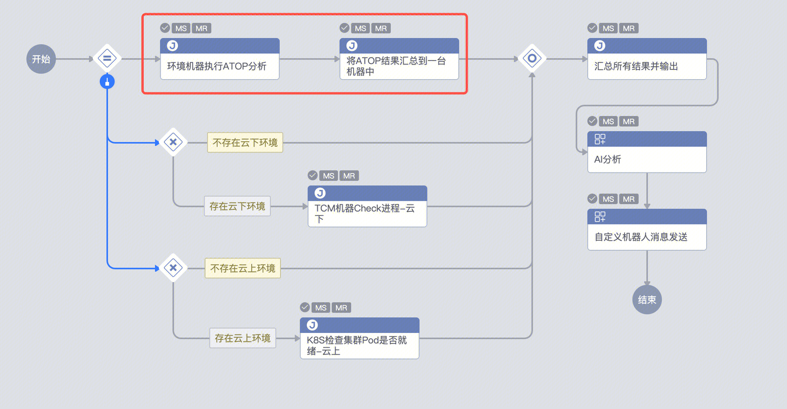

## 问题描述：

1. 调用job快速执行脚本时，如果目标服务器是多个，怎么拿到多个服务器上执行的日志呢
2. 
3. 就比如这里的第一个节点，是调用job快速执行脚本在所有机器上执行ATOP，希望在下一步能拿到所有的机器上ATOP的读取结果

## 解决方法：

    1.这种还是只能考虑用分支来做循环来实现了，或者变成子流程，每个子流程输入IP，子流程里的job只执行一个IP的

##   
## 易事厅链接：

[智研-易事厅](https://zhiyan.woa.com/servicedesk/detail/2734060?proj_id=27&module=14)