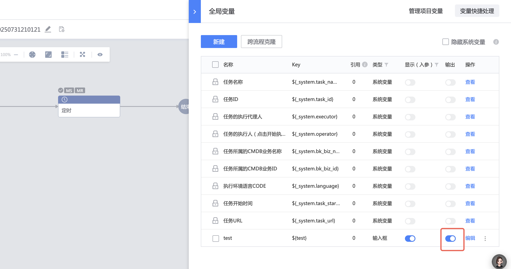
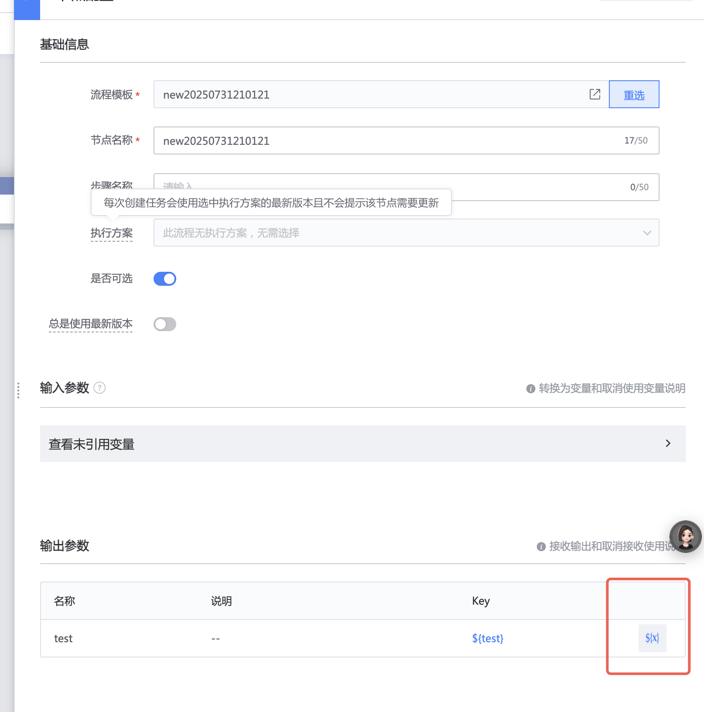

## 问题
主流程获取子流程的输出

## 解决方案
父流程引用这个子流程后，就能看到这个输出，然后勾选右边输出到当前的流程运行环境中（子流程的编辑里，勾选一下全局变量输出）
1、子流程全局变量打开对应变量输出开关

2、主流程勾选右边输出到当前的流程运行环境中

## 易事厅ID
[2730712](https://zhiyan.woa.com/servicedesk/detail/2730712?proj_id=27) 