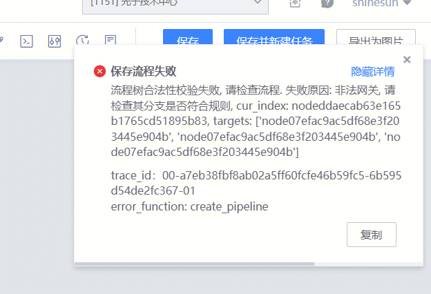
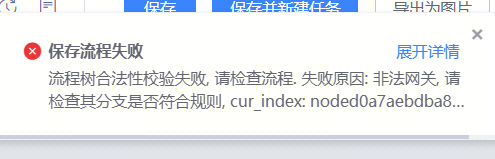
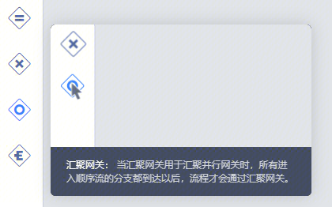
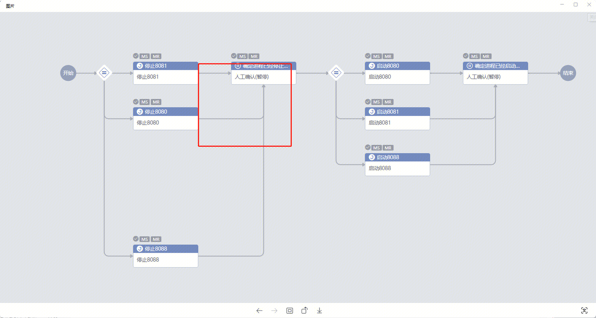
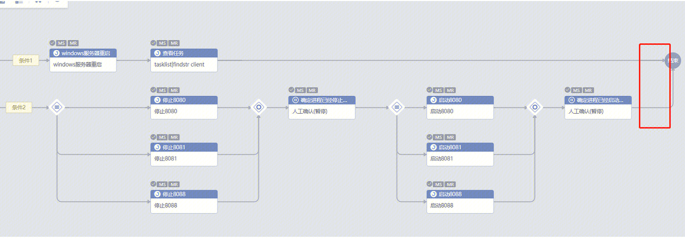
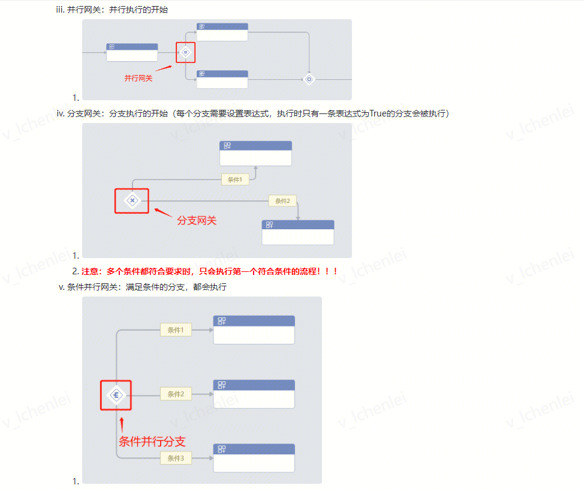

# 1. 问题

## Q1：使用了【并行网关】，无法保存流程

1. 用户描述：编写流程时，报错了，无法保存

## Q2：使用了【条件网关】，无法保留流程

1. 用户描述：编写流程时，报错了，无法保存

# 2. 解决方法

**增加【汇聚网关】**

1. 并行网关：在红框的位置加上汇聚网关

    
2. 条件网关：在红框的位置加上汇聚网关

    

# 3. 排查过程

**详情请见易事厅链接：**

1. 并行网关：[https://zhiyan.woa.com/servicedesk/detail/2712422?proj_id=27&module=14](https://zhiyan.woa.com/servicedesk/detail/2712422?proj_id=27&module=14)
2. 条件网关：[https://zhiyan.woa.com/servicedesk/chat/chatQuery?proj_id=27&session_id=1715221728625508352&show_detail=1](https://zhiyan.woa.com/servicedesk/chat/chatQuery?proj_id=27&session_id=1715221728625508352&show_detail=1)

# 4. 补充

## 标准运维创建流程时，网关的使用注意事项！

1. 使用【并行网关】和【条件网关】需要在最后添加 **汇聚网关**

    

