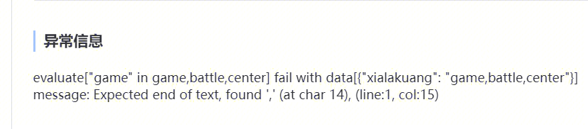
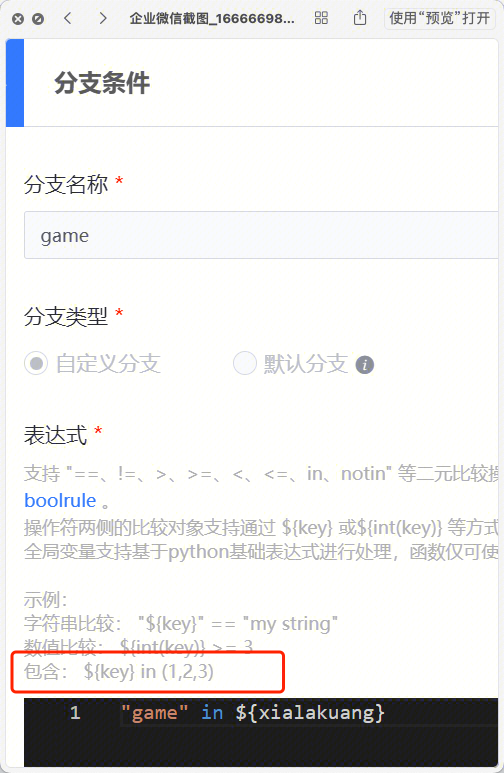

## 现象描述：

标准运维中判断字符串在下拉框获取的值中，这个该怎么写分支条件

## 问题定位及处理：

"game" in (${xxx})

####   
####   
####   
#### 易事厅单据链接：

[https://zhiyan.woa.com/servicedesk/#/detail/2706244?proj_id=27&module=1](https://zhiyan.woa.com/servicedesk/#/detail/2706244?proj_id=27&module=1)
