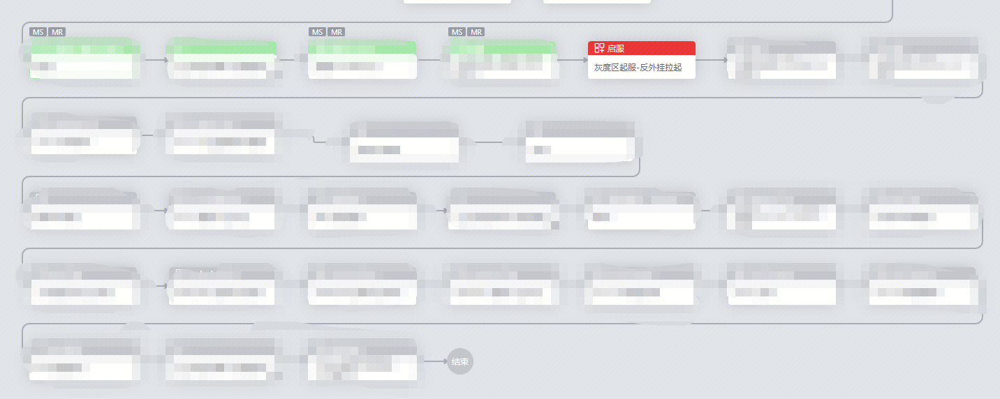
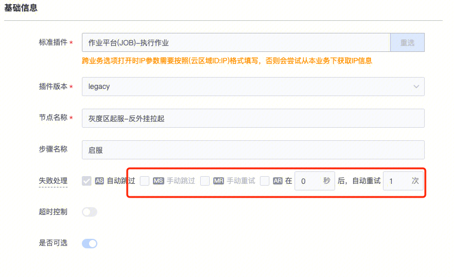

## 现象描述：

标准运维任务无法自动跳过，导致任务卡住

标准运维任务强制失败后无法手动跳过和自动跳过

## 问题定位及处理：

1.这个任务流程里没有配置手动跳过

2.自动跳过如果有人工干预以后，是无法自动跳过的

3.跳过这里的操作后续标准运维团队会优化

####   
####   
####   
#### 易事厅单据链接：

[https://zhiyan.woa.com/servicedesk/#/detail/2707772?proj_id=27](https://zhiyan.woa.com/servicedesk/#/detail/2707772?proj_id=27)

如果文档内容对您有帮助，请”点赞“；若没解决问题，请在评论区留言。