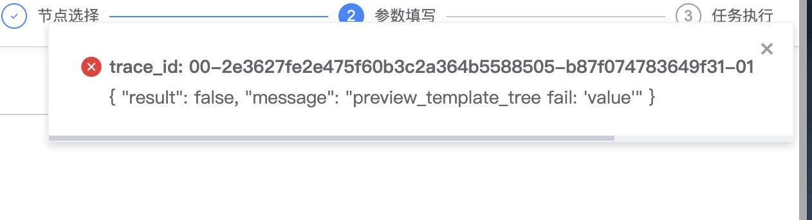

## 现象描述：

流程新建任务提示 "preview_template_tree fail: 'value"

## 问题定位及处理：

1.变量没有value字段，需重新配置，重新勾选生成。

2.如变量是子流程勾选到父流程的，需随便选一个作为默认值就正常了，这个可以创建任务的时候再改  
  
易事厅单据链接：

[https://zhiyan.woa.com/servicedesk/#/detail/2704901?proj_id=27&module=enquiry](https://zhiyan.woa.com/servicedesk/#/detail/2704901?proj_id=27&module=enquiry)

如果文档内容对您有帮助，请”点赞“；若没解决问题，请在评论区留言。