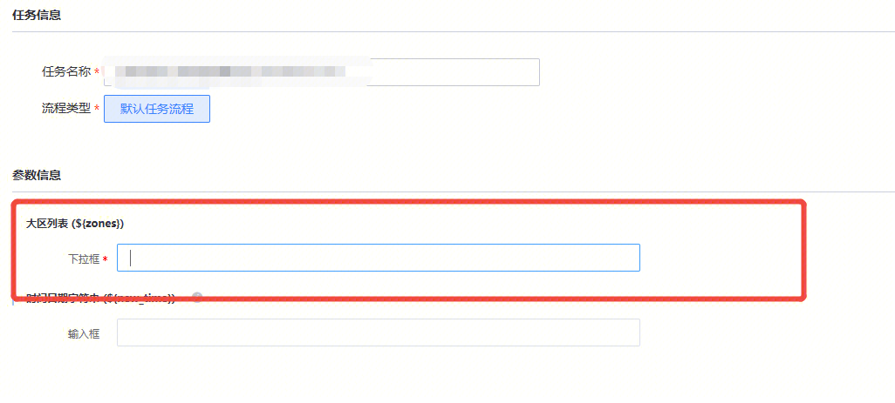

## 问题描述：

建单下拉框无法选值

 

## 问题原因：

po环境的网络跟内网是不通的，这种自定义下拉数据暂时没办法在po环境用

目前仅支持静态value

## 议事厅链接

[https://zhiyan.woa.com/servicedesk/detail/2730774?proj_id=27](https://zhiyan.woa.com/servicedesk/detail/2730774?proj_id=27)