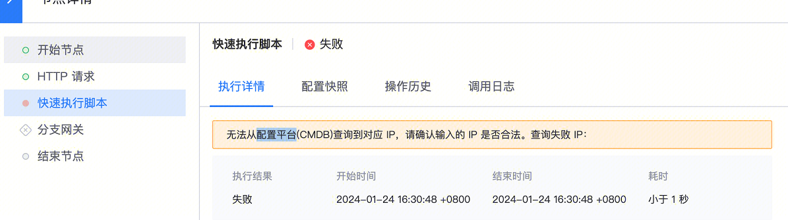
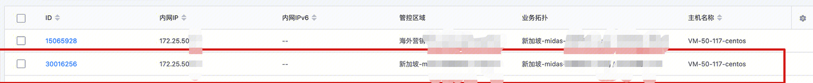

## 现象描述：

使用Bifrost初始化agent流程时报错无法查询到对应 IP  

 

## 问题定位及处理：

请在CMDB上云（[http://bkcc.oa.com/](http://bkcc.oa.com/)）新加坡（[https://cmdb.sg.crosgame.com/](https://cmdb.sg.crosgame.com/)）中根据环境确认排查：

（1）该IP是否真实存在。

（2）该IP是否属于该业务。

这个问题是因为配置平台有两个相同一模一样的内网IP，只是填IP的时候，标准运维不知道是代表那一台机器  

 

1.如果不想删除机器的话，在标准运维中，ip就不能直接写172.25.x.x，而是要带上管控区域id ，写成：区域id:172.25.x.x

2.如果可以删除其中一台机器的话，按照文档删除[https://iwiki.woa.com/p/4007126149](https://iwiki.woa.com/p/4007126149)

####   
####   
####   
#### 易事厅单据链接：

[https://zhiyan.woa.com/servicedesk/detail/2715156?proj_id=27&module=14](https://zhiyan.woa.com/servicedesk/detail/2715156?proj_id=27&module=14)  

  

如果文档内容对您有帮助，请”点赞“；若没解决问题，请在评论区留言。