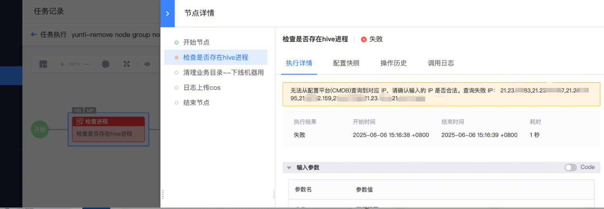

## 问题描述：

标准运维执行报错无法从配置平台(CMDB)查询到对应 IP，这个报错发生时是只有一个IP查不到，还是当时所有的IP都查不到

 

## 解决方法：

逻辑是返回的是全部的无效ip，如果是一个查不到的话，应该只返回那一个ip

##   
## 易事厅链接：

[https://zhiyan.woa.com/servicedesk/detail/2728393?proj_id=27&module=14](https://zhiyan.woa.com/servicedesk/detail/2728393?proj_id=27&module=14)