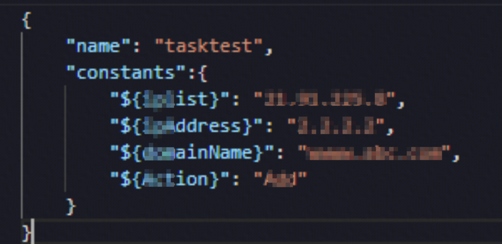

## 问题
http://bksops.bkapps.woa.com/taskflow/execute/5002624/?instance_id=89876072 ，create_task请求里已经创建了参数了，但是任务链接这里看起来还是没有的

## 原因/解决方案
1、格式不对。key应该是${变量}

## 易事厅ID
[2729779](https://zhiyan.woa.com/servicedesk/detail/2729779?proj_id=27&module=14) 