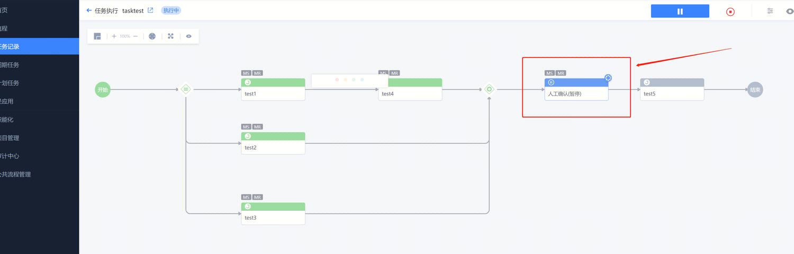
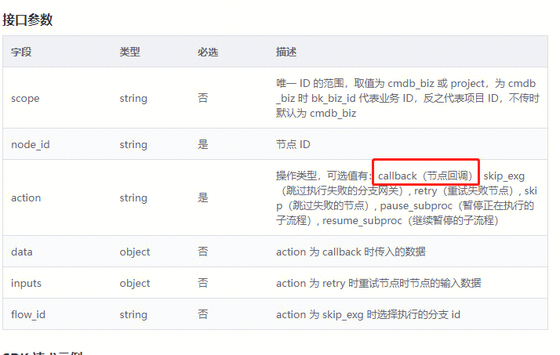

## 现象描述：

 

1.有没有api可以操作继续这个节点的

2.怎么拿node_id（节点id）  

## 问题定位及处理：

1.[https://bkapigw.woa.com/docs/apigw-api/bk-sops/apigw-api/bk-sops/operate_node/doc?stage=prod](https://bkapigw.woa.com/docs/apigw-api/bk-sops/apigw-api/bk-sops/operate_node/doc?stage=prod)可以用这个api来操作节点，继续流程类型选callback（节点回调）

 

2.使用**operate_node**操作节点api时需要node_id（节点id） 这个节点id需要看任务 id，任务会把所有的 id 重新刷一遍，执行任务中get_task_detail 接口拿id  

####   
####   
####   
#### 易事厅单据链接：

[https://zhiyan.woa.com/servicedesk/detail/2717224?proj_id=27&module=14](https://zhiyan.woa.com/servicedesk/detail/2717224?proj_id=27&module=14)  

  

如果文档内容对您有帮助，请”点赞“；若没解决问题，请在评论区留言。

