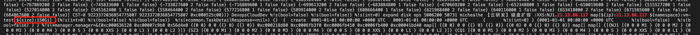
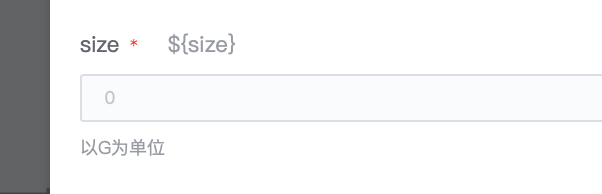
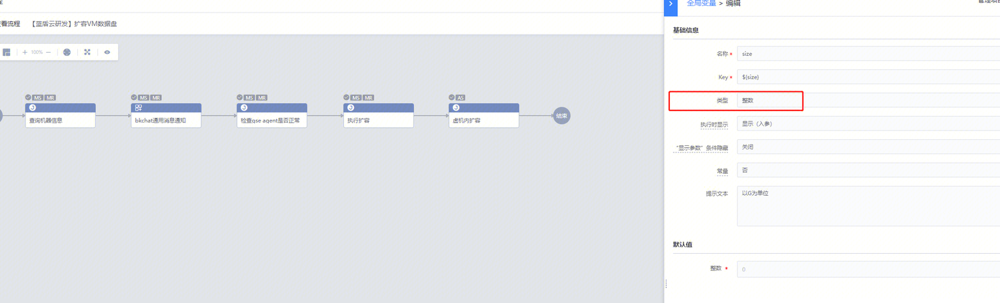

## 问题描述：

标准运维的任务 通过后台api创建的任务 发现有个参数size后台创建时传递的是150Gi 页面上看到的是0 [https://bksops.bkapps.woa.com/taskflow/execute/5002624/?instance_id=49849326](https://bksops.bkapps.woa.com/taskflow/execute/5002624/?instance_id=49849326)

创建作业的api：[https://bkapigw.woa.com/docs/apigw-api/bk-sops/apigw-api/bk-sops/create_task/doc?stage=prod](https://bkapigw.woa.com/docs/apigw-api/bk-sops/apigw-api/bk-sops/create_task/doc?stage=prod)

填入的参数：map[${ip}: IP  ${namespace}:vm-test ${size}:150Gi]

## 问题原因：

 

变量类型是整数，给的参数是150Gi

## 解决方法：

修改下传参为map[${ip}: IP  ${namespace}:vm-test ${size}:150] 即可

##   
## 易事厅链接：

[https://zhiyan.woa.com/servicedesk/detail/2717805?proj_id=27&module=14](https://zhiyan.woa.com/servicedesk/detail/2717805?proj_id=27&module=14)