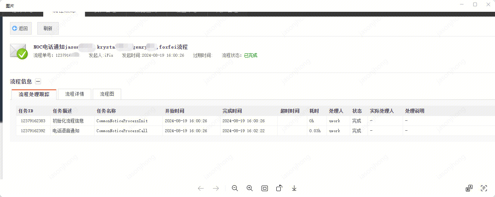
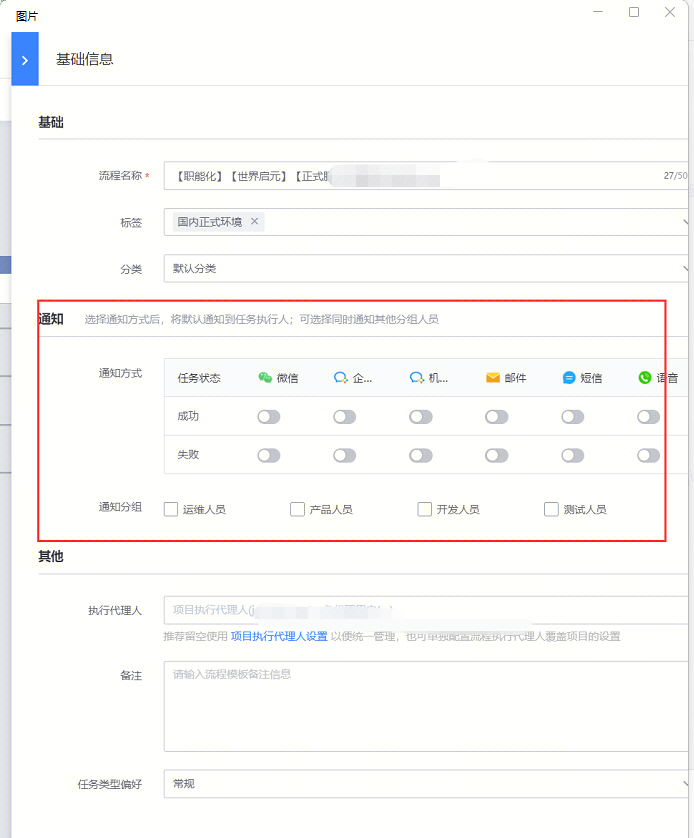
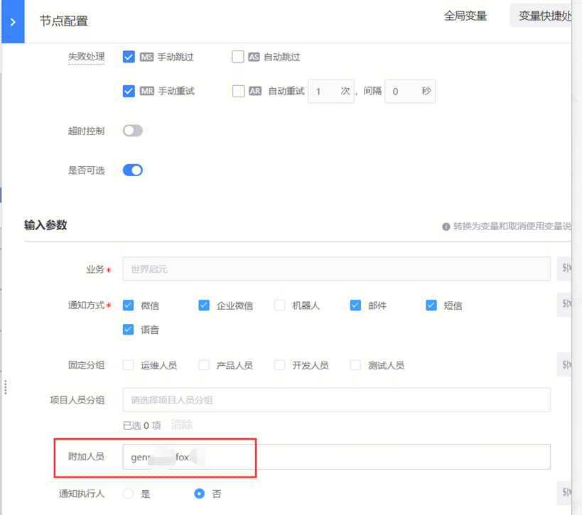

## 问题描述：

配置了电话告警，电话是只打其中一个吗，顺序是怎么指定的

## 问题原因：

NOC那边电话告警是按顺序告的，第一个不可达才会到第二个

 

## 解决方法：

1.如果是流程的电话通知，默认通知执行人

 

2.如果是插件的通知，通知人在通知列表里，优先通知

 

##   
## 易事厅链接：

[https://zhiyan.woa.com/servicedesk/detail/2720822?proj_id=27&module=14](https://zhiyan.woa.com/servicedesk/detail/2720822?proj_id=27&module=14)