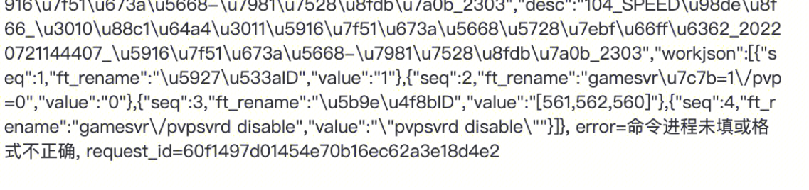
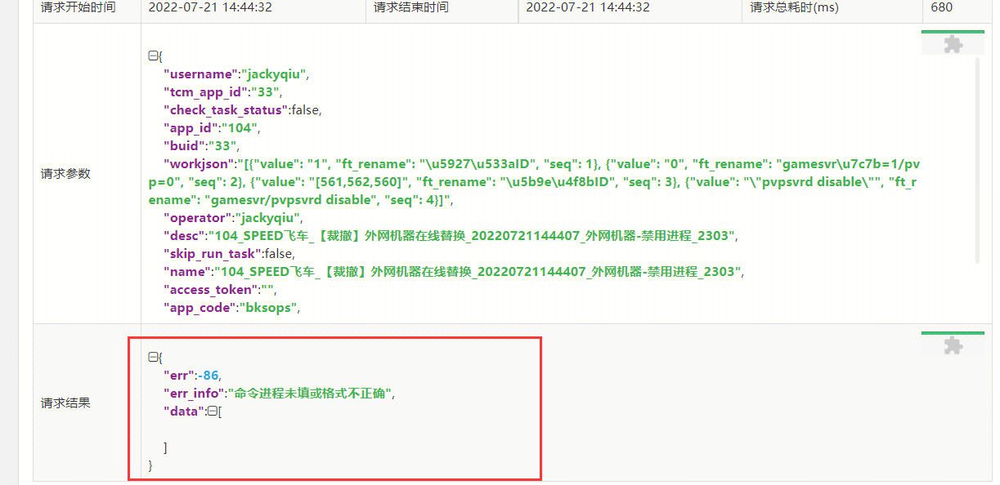
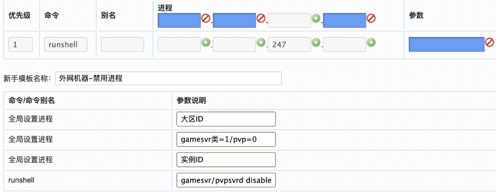

## 现象描述：

autotcm上正常执行，从标准运维插件执行报错。提示命令进程未填或格式不正确

## 问题定位及处理：

新手模板需调整，调整样例：

####
####   
####   
####   
#### 易事厅单据链接：

[https://zhiyan.woa.com/servicedesk/#/detail/2704494?proj_id=27&module=enquiry](https://zhiyan.woa.com/servicedesk/#/detail/2704494?proj_id=27&module=enquiry)

如果文档内容对您有帮助，请”点赞“；若没解决问题，请在评论区留言。