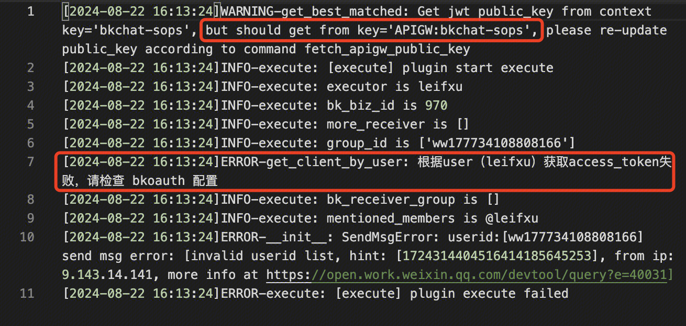
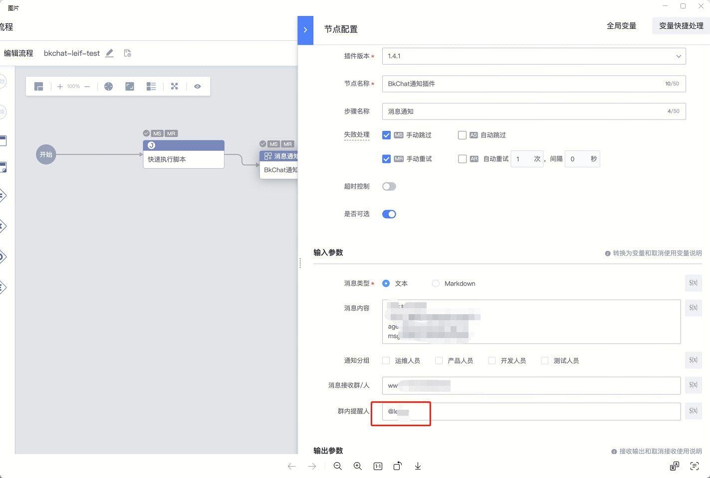

## 问题描述：

标准运维调用bkchat通知插件报错

 

## 解决方法：

 

这里不需要@ 删除@即可

##   
## 易事厅链接：

[https://zhiyan.woa.com/servicedesk/detail/2720960?proj_id=27&module=14](https://zhiyan.woa.com/servicedesk/detail/2720960?proj_id=27&module=14)