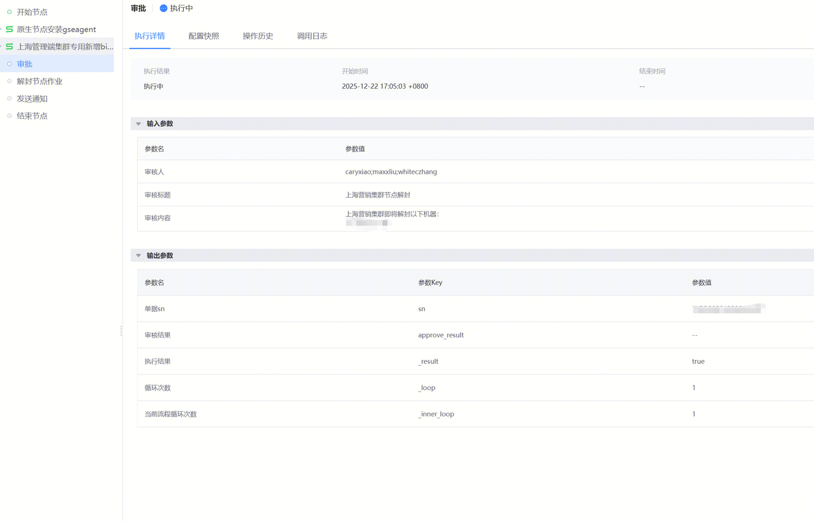

## 问题描述：

1. 没有收到这种审批的消息
2. 
3. 

## 问题原因：

    1.审核人有多人需要分隔时，不能填写“;” 要用“,”

##   
## 易事厅链接：

[https://zhiyan.woa.com/servicedesk/detail/2734155?proj_id=27](https://zhiyan.woa.com/servicedesk/detail/2734155?proj_id=27)

