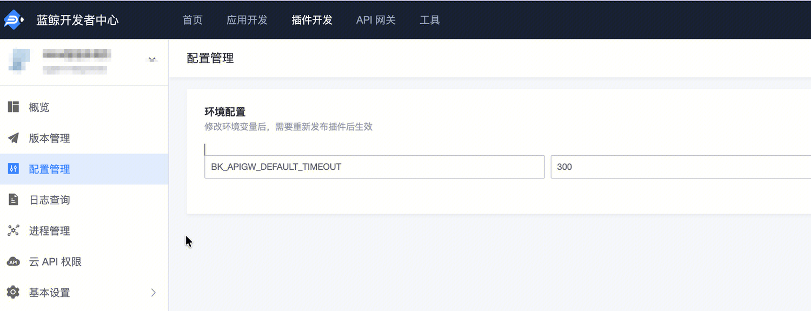

## 问题描述：

标准运维插件在开发者中心发版后，插件超时时间会被重置为 60 秒，导致每次代码发布或插件版本更新后，都需要手动重新修改超时时间。

排查过程按顺序如下：

1. 反馈现象：3 月 24 日上午，业务侧反馈每次发布插件版本后，超时时间都会被重置为 60 秒。
2. 初步定位：排查确认该问题发生在插件发版之后，且在网关页面手工修改的超时时间会被后续发布重新覆盖。
3. 原因分析：插件发布时会生成并同步配置到网关，因此仅在网关页面修改超时时间，发版后会被发布配置刷掉。
4. 场景确认：进一步确认该插件类型为“标准运维插件”，不是 AIDev Agent 插件应用。
5. 方案确认：标准运维插件需要通过环境变量配置默认超时时间，而不是只在网关页面临时修改。

根因总结：

- 根因不是网关页面修改失败，而是发布流程会重新下发配置。
- 超时时间应固化在标准运维插件的环境变量配置中，否则每次发版都会恢复为默认值 60 秒。

# 解决办法:

在插件环境变量中配置以下参数：
- `BK_APIGW_DEFAULT_TIMEOUT=300`

处理建议：
1. 进入标准运维插件对应的配置管理或环境变量配置页面。
2. 新增或修改环境变量 `BK_APIGW_DEFAULT_TIMEOUT`。
3. 将其值设置为 `300`（单位：秒）。
4. 保存配置后重新发布插件。
5. 发布完成后再次确认插件超时时间是否已按预期生效，避免继续被重置为 60 秒。

结论：
该问题的本质是“发布配置覆盖了网关页面手工修改结果”。正确做法是在标准运维插件的环境变量中配置默认超时时间，例如 `BK_APIGW_DEFAULT_TIMEOUT=300`，这样后续发版时配置才能持续生效。