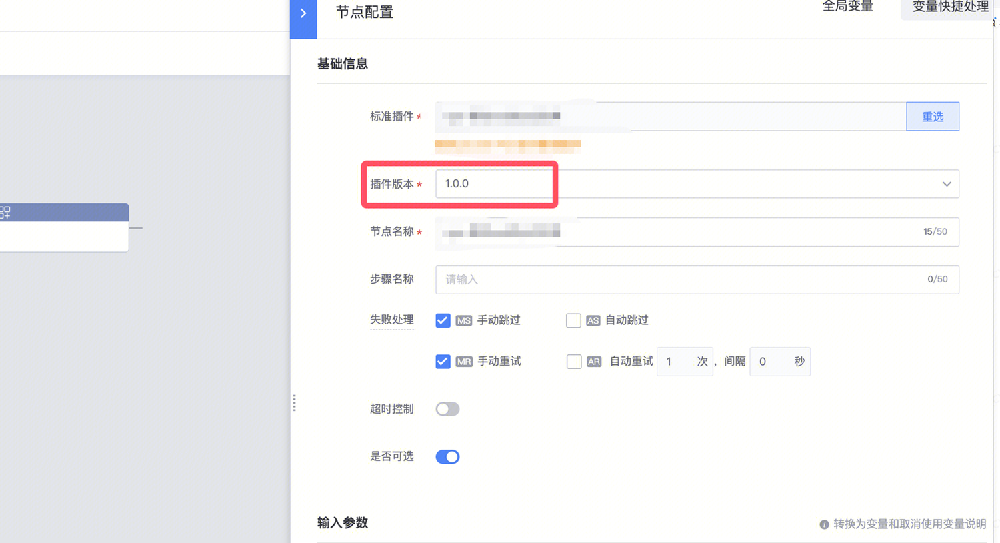
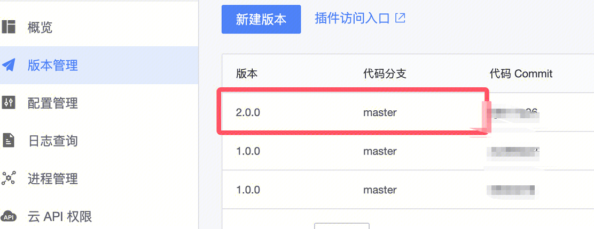

## 问题描述：

## 解决方法：

1.只保留2.0版本的插件

如何找到这个文件  
进入你的插件代码仓库（工蜂/Git 上的插件应用仓库）  
找到插件的主逻辑文件（通常在   plugin.py   或类似命名的文件中）  
搜索   class Meta   或   version =   关键字  
✅ 确认版本是否正确的完整步骤| 步骤 | 操作 |   
| 1 | 打开插件代码仓库，找到   Meta   类中的   version   字段 |   
| 2 | 确认   version = "2.0"   已正确设置 |   
| 3 | 提交代码到仓库 |   
| 4 | 在 蓝鲸 PaaS 开发者中心 → 插件应用 重新部署到生产环境 |   
| 5 | 回到标准运维，刷新后检查是否可以选择 2.0 版本 | 

class Plugin(SceneMeta):  
    # 版本号就在这里定义  
    class Meta:  
        version = "2.0"        # 这里改为 2.0  
        desc = "插件功能描述"   # 版本说明

二  1.0和2.0版本插件都在标准运维上面保留

关键点：版本号在代码   Meta   类中定义，不同版本号的代码同时部署即可共存。  
插件代码中每个版本对应一个独立的   Plugin   类，通过   Meta.version   区分：  
# 1.0 版本  
class MyPluginV1(Plugin):  
    class Meta:  
        version = "1.0"  
        desc = "旧版本说明"

    def execute(self, inputs, runtime):  
        # 1.0 的逻辑  
        ...

# 2.0 版本  
class MyPluginV2(Plugin):  
    class Meta:  
        version = "2.0"  
        desc = "新版本说明"

    def execute(self, inputs, runtime):  
        # 2.0 的新逻辑  
        ...  
两个版本类写在同一个代码文件中，部署后标准运维会同时识别到   1.0   和   2.0   两个版本。  
🖱 在标准运维中如何选择版本  
在流程编辑页面，拖入第三方插件节点后，会有版本下拉框可以选择：  
节点编辑面板  
└── 插件：xxx插件  
    └── 版本：[ 1.0 ▼ ]  ← 点击可切换 1.0 / 2.0  
不同流程模板可以各自选择不同版本，互不影响。

