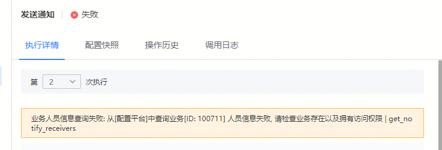
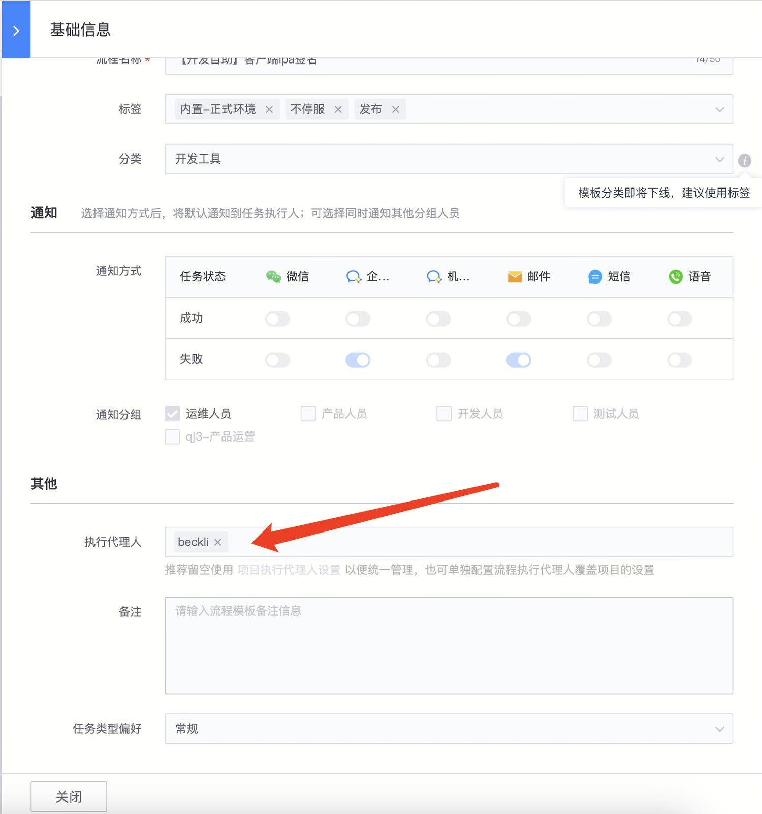

## 现象描述：

业务是存在的，执行人也是有业务访问权限的  

## 问题定位及处理：

标准运维流程配置了代理执行人，代理执行人已离职，可以改下这个流程的执行代理人  

####   
####   
####   
#### 易事厅单据链接：

[https://zhiyan.woa.com/servicedesk/detail/2716027?proj_id=27&module=14](https://zhiyan.woa.com/servicedesk/detail/2716027?proj_id=27&module=14)  

  

如果文档内容对您有帮助，请”点赞“；若没解决问题，请在评论区留言。