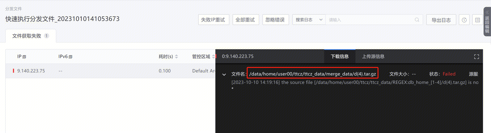
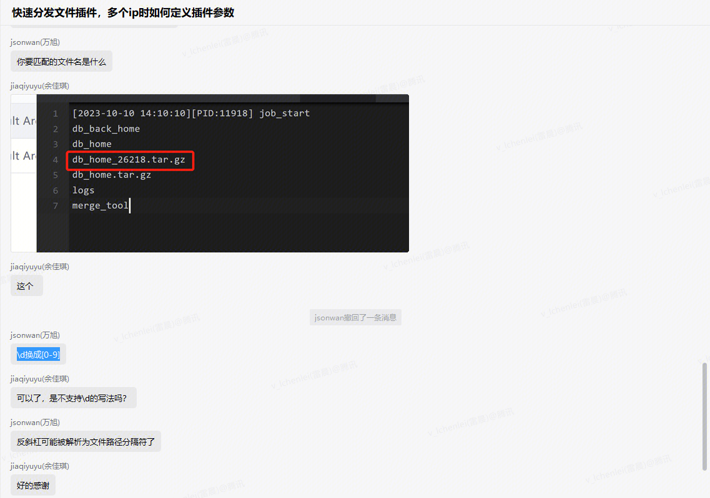

# 问题

1. 用户描述：请问快速分发文件的这个插件，如果源IP有多个，应该用什么分隔？

    
    

# 解决方法

1. IP这一栏参数，**支持  逗号、换行**

# 排查过程

**详情请见易事厅链接：**[https://zhiyan.woa.com/servicedesk/#/detail/2712163?proj_id=27](https://zhiyan.woa.com/servicedesk/#/detail/2712163?proj_id=27)

# 补充

## 作业平台-分发文件功能-源文件路径正则表达式Tips

1. 用户提问：这个正则不能这样写吗？为啥匹配不到呢？

    
    
    
    
2. 疑惑解答：\d换成[0-9]

    1. 不推荐使用反斜杠，可能被解析为文件路径分隔符了
    
        
        
    

