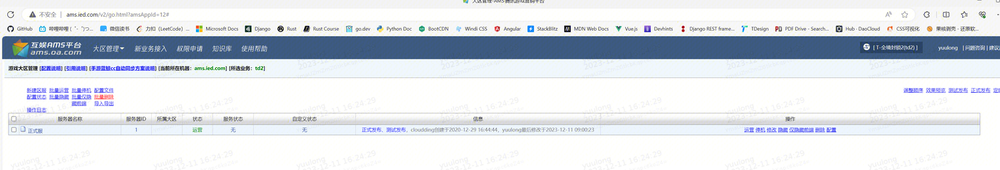

[toc]

# 问题描述

- 想调整这个大区状态，应该在标准运维中使用哪个插件呢，我目前使用的是：游戏大区管理(WEBPLAT)-批量更新区服状态，但看起来没法和业务对上

- 只让我输入了一个大区 id，应该怎么和业务对上呢，因为我们在 ams 上有三个业务

# 问题定位

- ams相关的插件 ，拿cmdb的业务ID传到AMS的
- ams 是一个平台

- 用户在ams上有三个业务，但是在蓝鲸上bkcc上只有一个业务，需要咨询ams平台，那个业务对应的是蓝鲸的业务，在对应的业务上使用插件

#问题解决方案

- 在ams找到对应的业务，在进行选择对应的大区ID

**易事厅链接：**https://zhiyan.woa.com/servicedesk/detail/2713970?proj_id=27&module=14