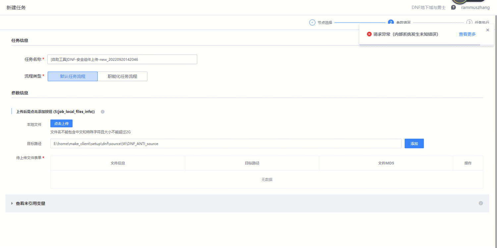
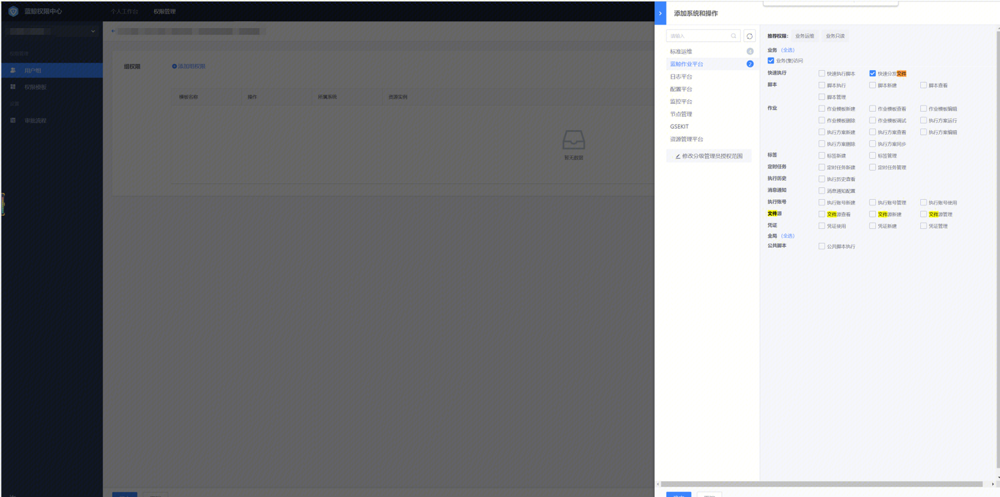

## 现象描述：

部分同学文件上传会出现上传文件进度卡在100%或报错情况

上传文件会卡在百分之百

## 问题定位及处理：

问题定位:

标准运维最近做了一个切换，之前本地上传是到一个固定服务器，现在是走的job上传，做了鉴权，卡在百分之百因为上传文件的同学缺少作业平台文件分发权限

问题处理

去权限中心申请作业平台文件分发权限  [http://iam.woa.com/](http://iam.woa.com/)

或让运维同学给你添加该权限

####   
####   
####   
#### 易事厅单据链接：

[https://zhiyan.woa.com/servicedesk/#/detail/2705789?proj_id=27&module=1](https://zhiyan.woa.com/servicedesk/#/detail/2705789?proj_id=27&module=1)

如果文档内容对您有帮助，请”点赞“；若没解决问题，请在评论区留言。