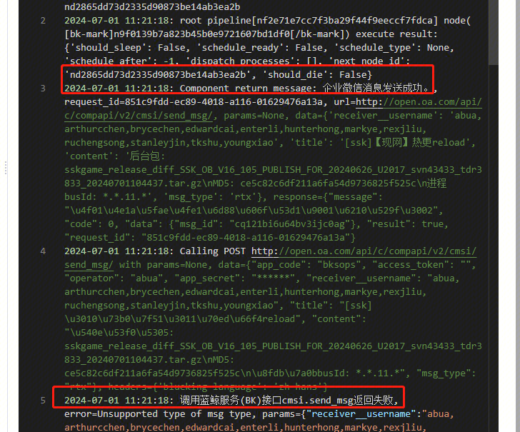

## 问题描述：

 

[https://bksops.bkapps.woa.com/taskflow/execute/5001213/?instance_id=53394853](https://bksops.bkapps.woa.com/taskflow/execute/5001213/?instance_id=53394853)

## 问题原因：

这个模板是之前标准运维V1迁移到V3导致的问题

## 解决方法：

目前的解决方案是这个节点 重新创建通知节点并重新配置，插件版本选1.0

##   
## 易事厅链接：

[https://zhiyan.woa.com/servicedesk/detail/2719267?proj_id=27&module=14](https://zhiyan.woa.com/servicedesk/detail/2719267?proj_id=27&module=14)