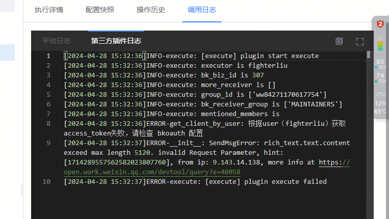
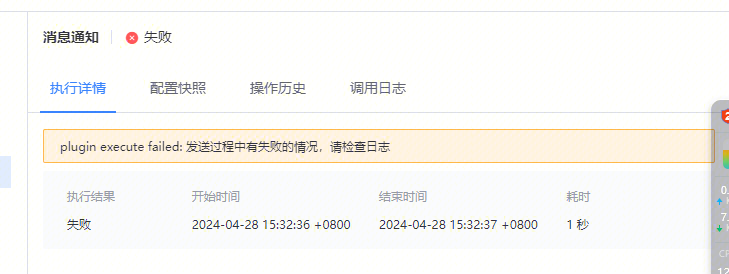

## 现象描述：

   

在调用 BkChat通知插件 出现这个access_token错误

## 问题定位及处理：

原因是消息内容太长了，报错提示是引用蓝鲸bk-oauth sdk的，所以不太明确，后续会考虑优化下插件报错提示，有长文本通知需求使用

   
  
  
易事厅单据链接：

[https://zhiyan.woa.com/servicedesk/detail/2717367?proj_id=27&module=14](https://zhiyan.woa.com/servicedesk/detail/2717367?proj_id=27&module=14)  
