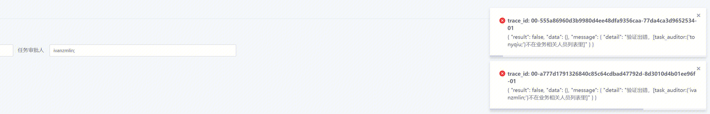
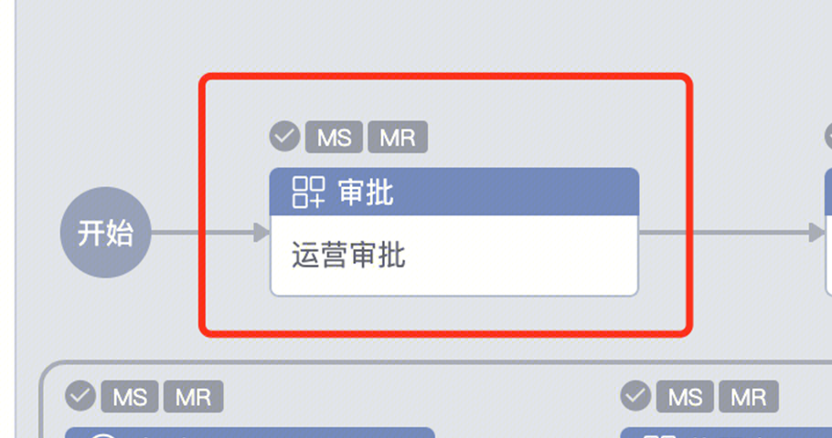
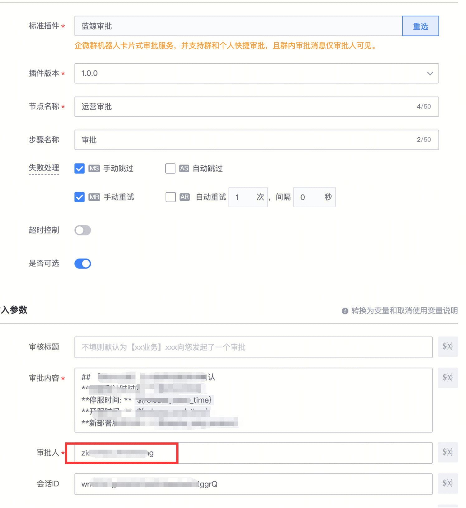

## 问题描述：

  

添加内部审批人报错，外部账号执行，然后内部账号审批

## 问题原因：

不用在这里配置

## 解决方法：

 这样审批

##   
## 易事厅链接：

[https://zhiyan.woa.com/servicedesk/detail/2719969?proj_id=27&module=14](https://zhiyan.woa.com/servicedesk/detail/2719969?proj_id=27&module=14)