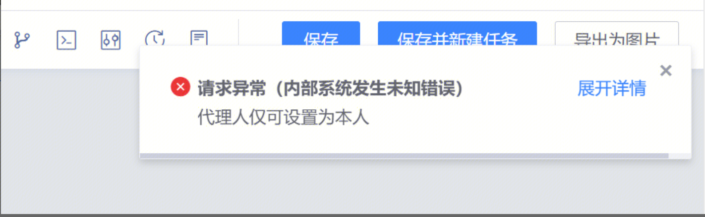
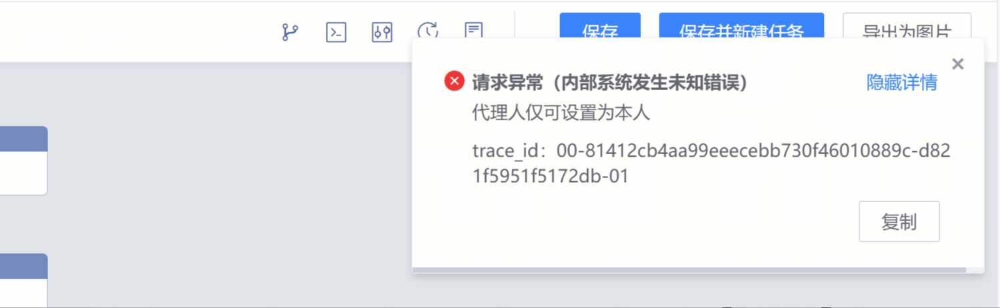
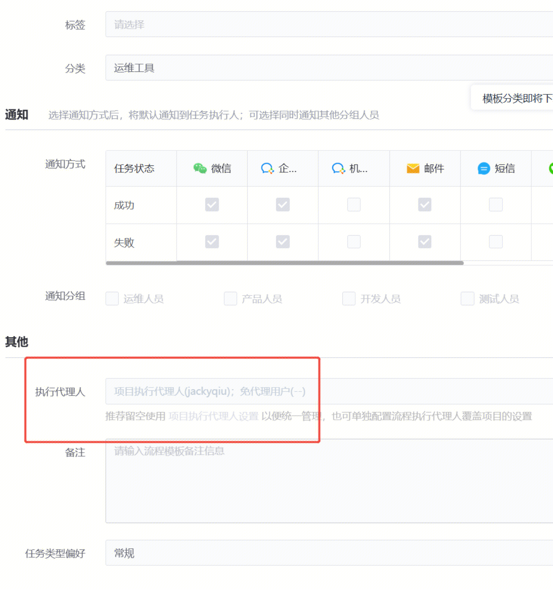

## 问题描述：

1.流水线代理人填写错误

 

 

## 问题原因：

    1.流水线代理人只能填写本人

## 解决方法：

1.现在是不能这么填的，只能填写本人

2.流程里执行代理人留空，从项目的执行代理人继承过来

 

##   
## 易事厅链接：

[https://zhiyan.woa.com/servicedesk/detail/2727740?proj_id=27&module=14](https://zhiyan.woa.com/servicedesk/detail/2727740?proj_id=27&module=14)

