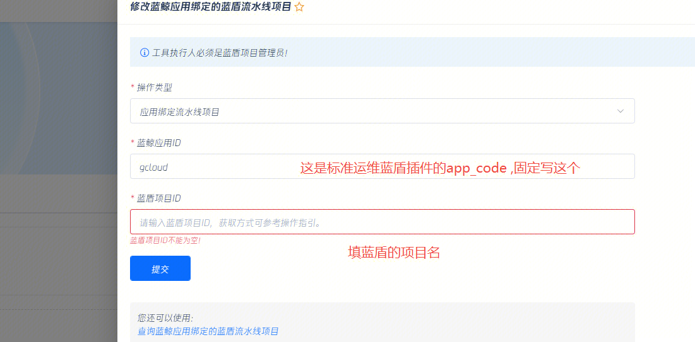

### 问题：
标准运维用蓝盾插件调流水线没执行权限
### 原因：
原因一：蓝盾流水线没授权这个插件调用 [自助授权](https://o2000.woa.com/selfservice/tools-lobby?id=2) 

原因二：
标准运维如果配置了执行代理人，那蓝盾效验的是执行代理人权限。并且流水线最后保存人如果没执行权限的话也执行不了
易事厅链接：https://zhiyan.woa.com/servicedesk/detail/2728319?proj_id=27&module=14

### 原因三：
如果前面两个都确认没问题的话，提供下蓝盾的项目名和流水线ID，请o2000 看下接口的日志。他们绝对能看，不要信他们的推脱
