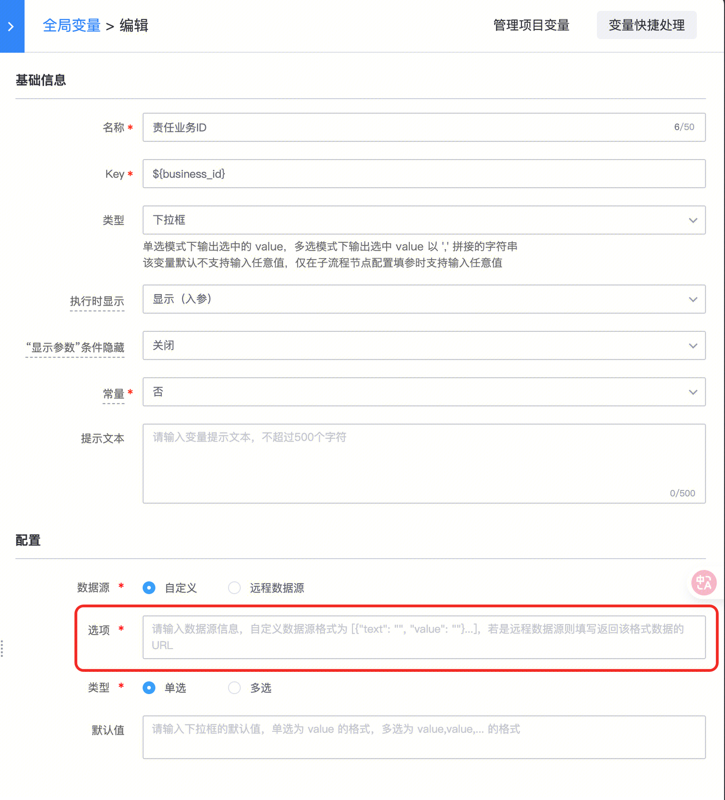

## 问题描述：

1.填 apigw 的接口是否可以

2.这里有用来测试的接口吗

## 解决方法：

1.这里要求远程数据拉取的接口，是不带鉴权的，也允许跨域访问

2.没有测试远程数据源的接口，一般是用户自行配置的

##   
## 易事厅链接：https://zhiyan.woa.com/servicedesk/detail/2731554?proj_id=27&module=1

