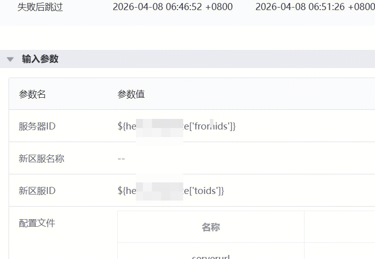
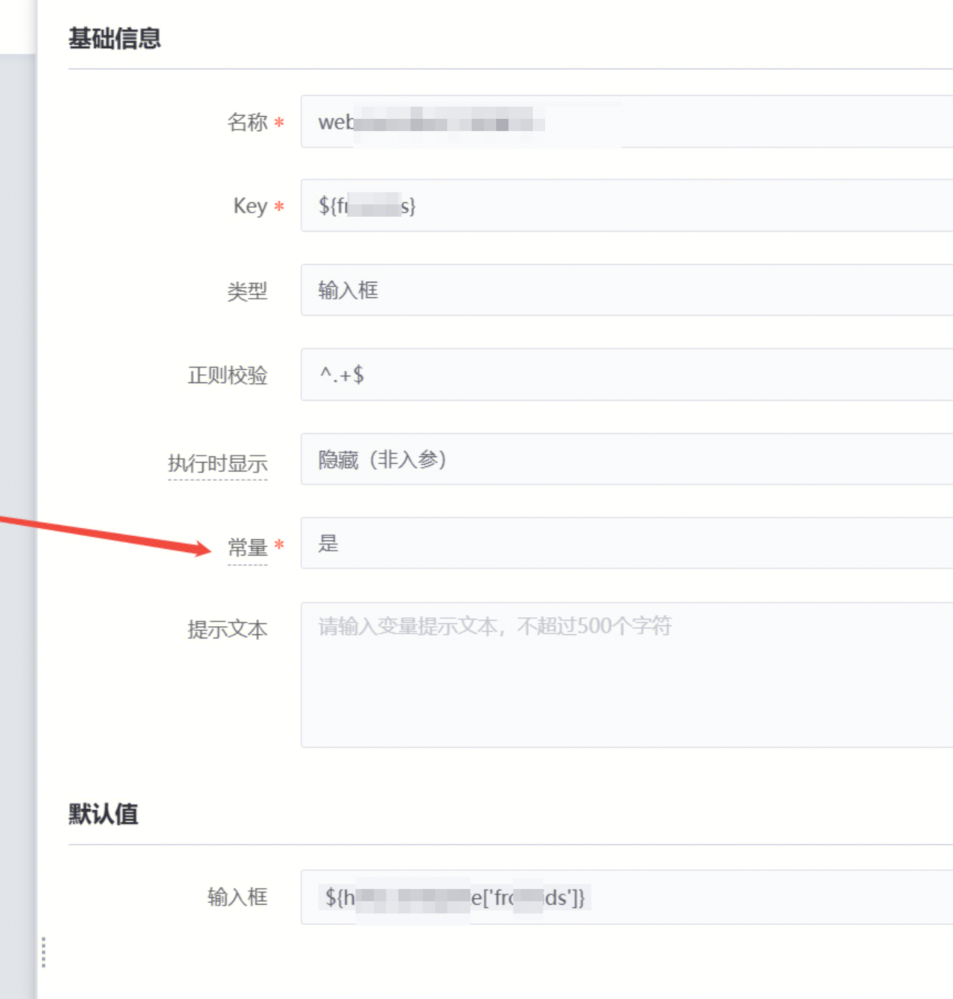

### 问题：
用标准运维输出全局变量的功能，输出的变量，在其他节点使用没有渲染
代码里已经安装格式打印了
<SOPS_VAR>key:val</SOPS_VAR> 的变量会被提取到 log_outputs['key'] 

### 原因：
这个输出的全局变量套了一层，然后那个最终的变量的“常量”选择了【是】，导致流程执行的时候不能再次渲染

易事厅链接：https://zhiyan.woa.com/servicedesk/detail/2737122?proj_id=27&module=14
