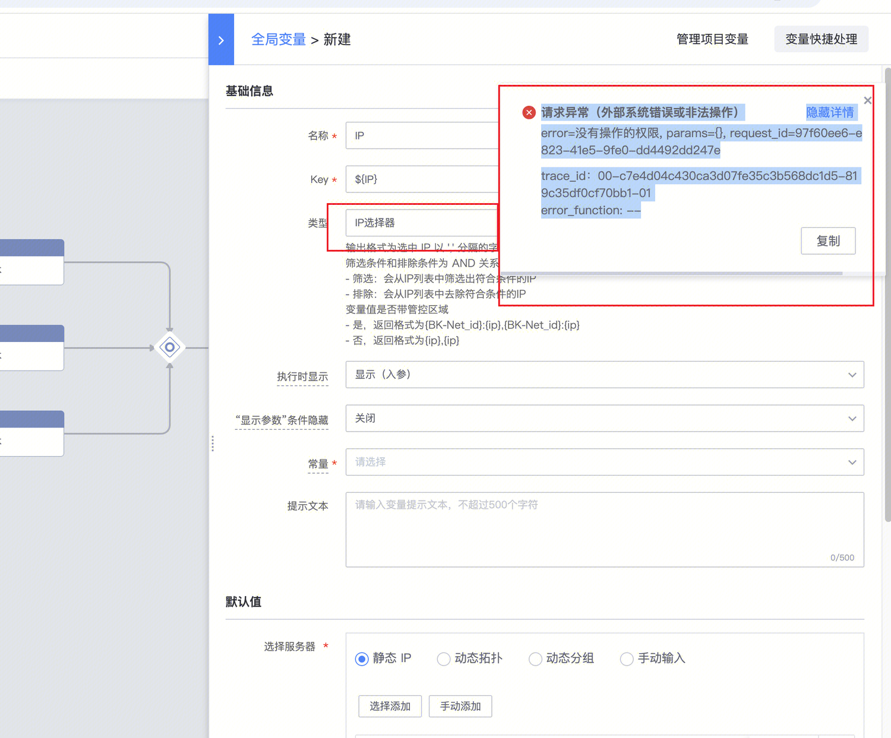
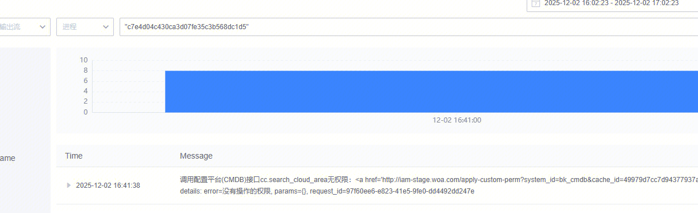
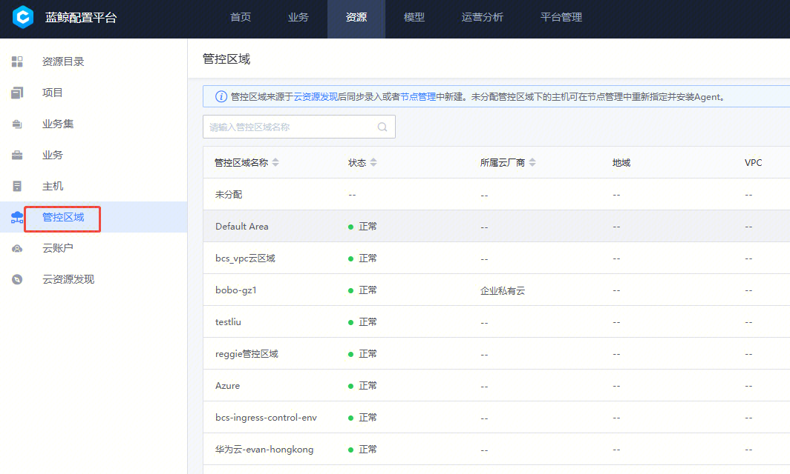

## 问题描述：

1. 新建流程报错
2. 

## 问题原因：

1.找标准运维开发拉取日志，发现是调用配置平台(CMDB)接囗cc.search_cloud area无权限

## 解决方法：

1.配置平台-管控区域 这个页面有没有权限

##   
## 易事厅链接：

[https://zhiyan.woa.com/servicedesk/detail/2733514?proj_id=27](https://zhiyan.woa.com/servicedesk/detail/2733514?proj_id=27)