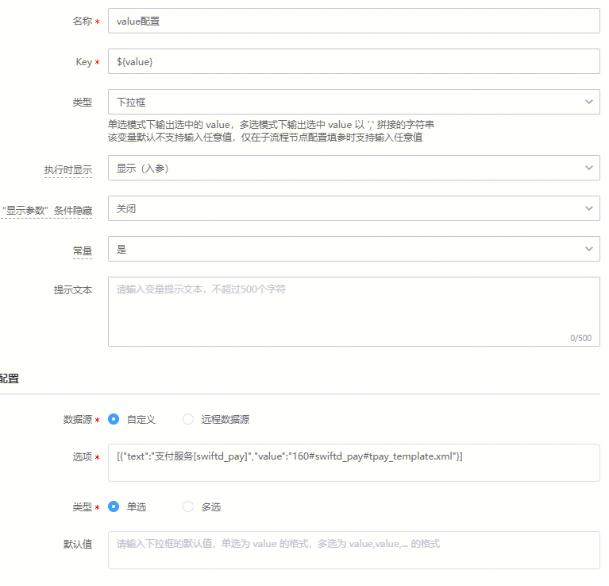

# 需求描述

- 变量名${value}，变量值160#swiftd_pay#tpay_template.xml，是否有语法可以直接拿到“swiftd_pay”字段，就是用#分隔取第二个值

# 解决方案
- ${value.split('#')[1]} 可以拿到，${}里面可以使用简单的python运算
- 由于不支持通过#进行分割取值，需找其他符合进行替换

工单链接：https://zhiyan.woa.com/servicedesk/#/detail/2711909?proj_id=27