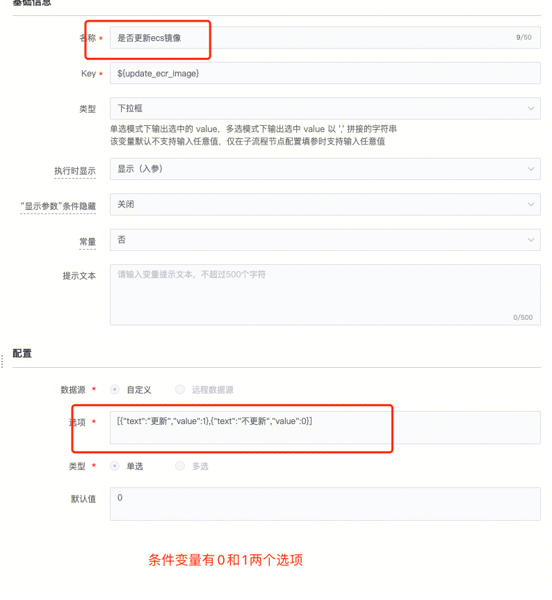

## 现象描述：

标准运维变量条件隐藏这里，设置了以后没有生效

## 问题定位及处理：

  
选项里的1和0的地方需要加上""

####   
####   
####   
#### 易事厅单据链接：

  
[https://zhiyan.woa.com/servicedesk/detail/2716438?proj_id=27&module=33](https://zhiyan.woa.com/servicedesk/detail/2716438?proj_id=27&module=33)

  

如果文档内容对您有帮助，请”点赞“；若没解决问题，请在评论区留言。