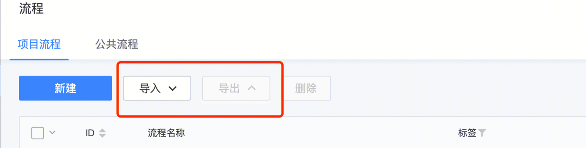
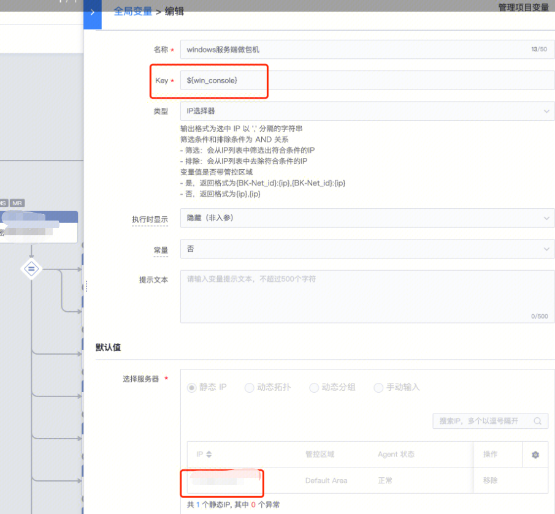
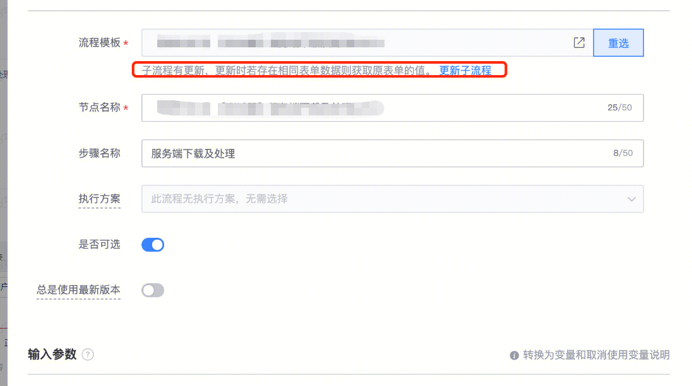
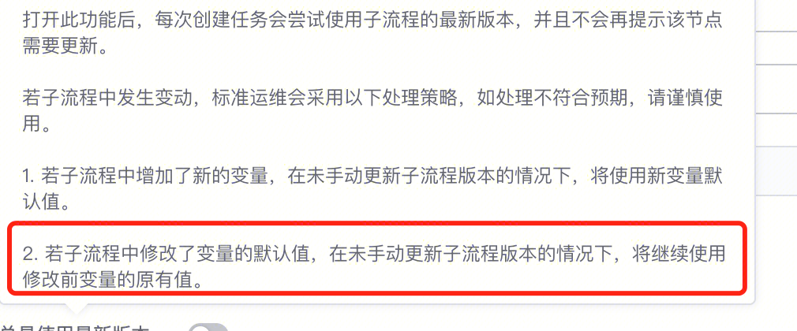

[toc]

# 现象描述

- 用户使用导出的流程模板 新建任务 更改里面流程的机器IP 后，新建的任务还是引用的旧IP

#问题定位及处理
- 用户使用导出的流程模板新建任务之前更改了子流程里面的全局变量，后还是引用的旧全局变量

- 当使用旧模板后，需要更新子流程

易事厅链接：https://zhiyan.woa.com/servicedesk/detail/2716034?proj_id=27&module=41