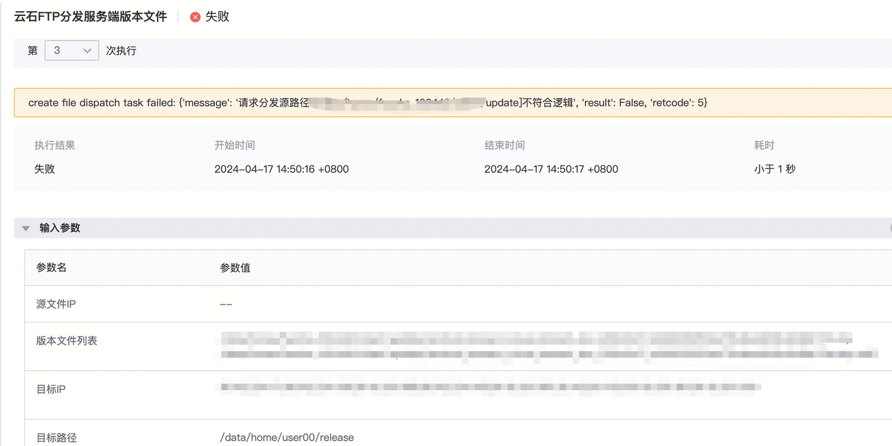
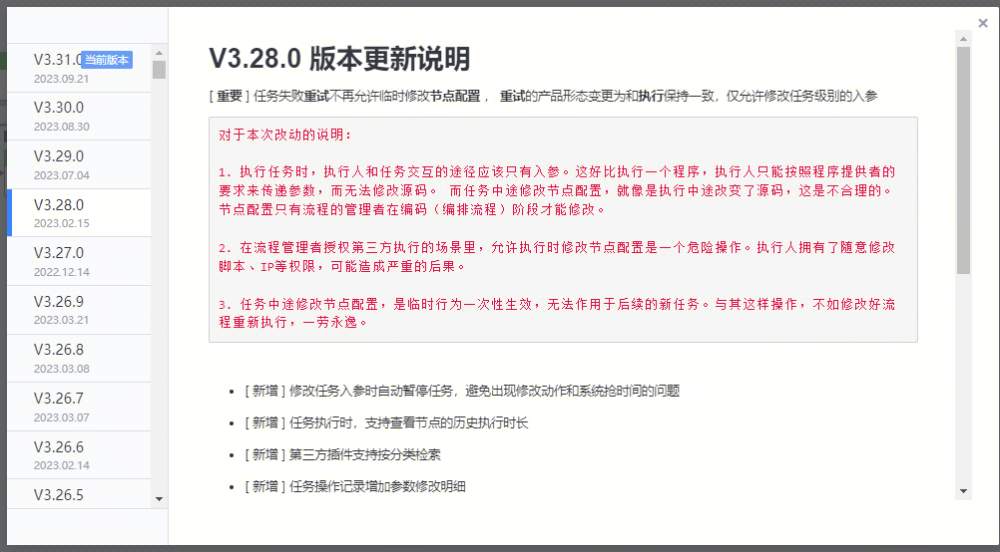

[toc]

# 现象描述
- 标准运维流程中有子流程，任务报错后修改了流程中的任务入参，重试任务失败，环境变量无法成功渲染

# 问题定位及处理
- 修改的是父流程的变量，重试的是子流程里面的节点，这个过程不会重新执行子流程节点，所以父流程的变量不会重新渲染
- 修改任务入参让流程重新渲染环境变量不支持对子流程操作

易事厅链接：https://zhiyan.woa.com/servicedesk/detail/2717065?proj_id=27&module=41