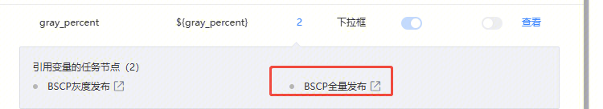
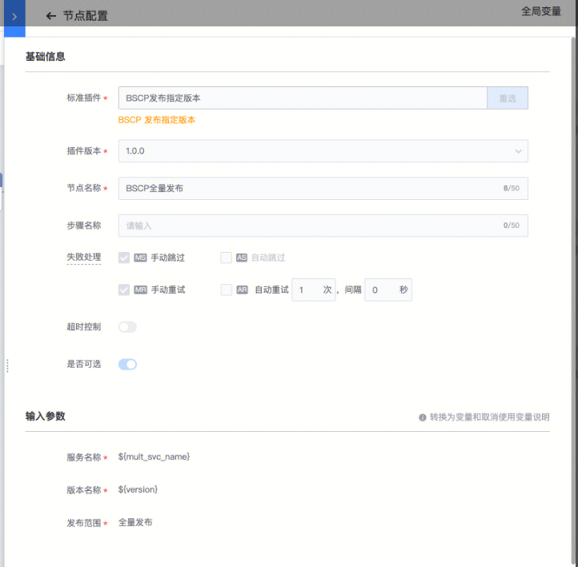

## 问题描述：

## 问题原因：

之前也引用过这个全局变量，后来修改了，这里其实还是存在引用关系，只不过变量被隐藏了，表单实际还是有值的，只是会根据「发布范围」这个选项值动态隐藏

## 解决方法：

如果想要去掉引用关系，可以切换到这个页面，把值手动删掉

##   
## 易事厅链接：

[https://zhiyan.woa.com/servicedesk/detail/2732490?proj_id=27&module=14](https://zhiyan.woa.com/servicedesk/detail/2732490?proj_id=27&module=14)