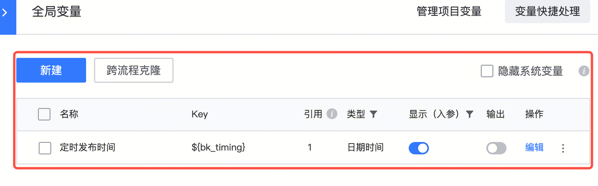
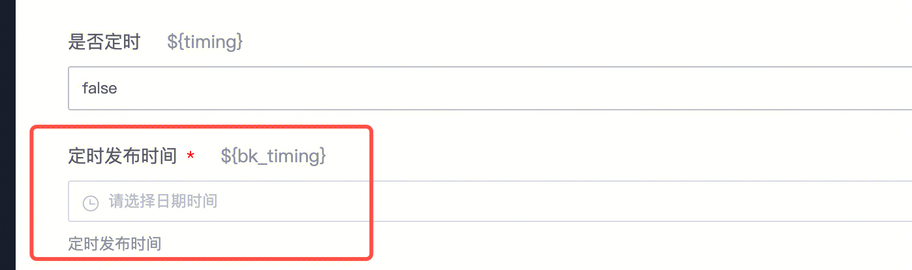
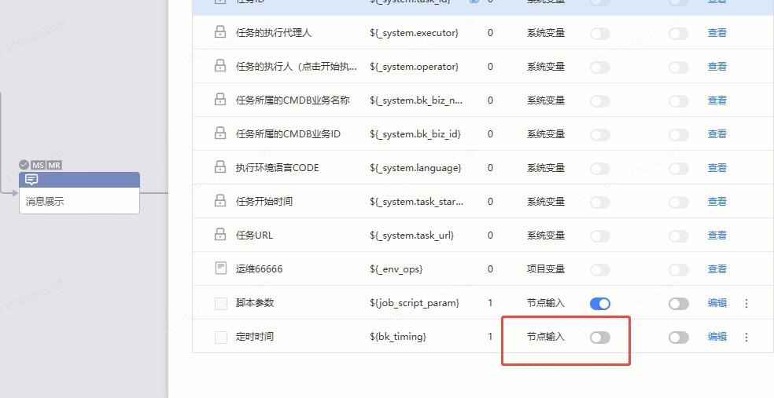
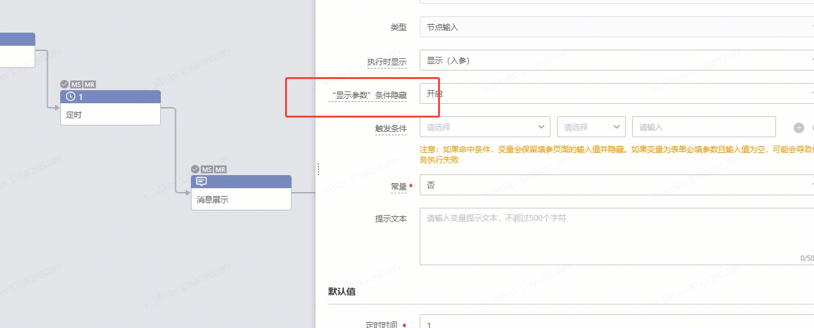

## 问题描述：

1. 定时变量如何设置成非必填参数
2. 
3. 

## 问题原因：

1.可以不勾选这个节点

2.或者加个触发条件

##   
## 易事厅链接：

[https://zhiyan.woa.com/servicedesk/detail/2734730?proj_id=27](https://zhiyan.woa.com/servicedesk/detail/2734730?proj_id=27)