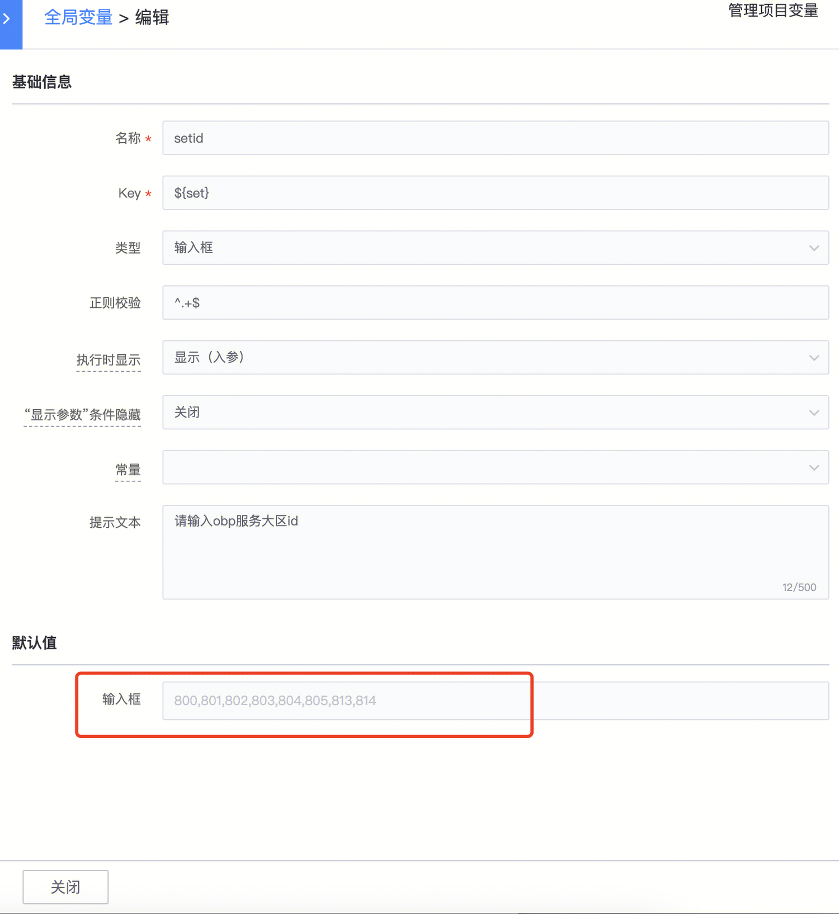

## 问题：

标准运维输入框插件可以容纳多长的字符串

 

  

## 回答：

平台这里是没有做限制的，可能浏览器会有限制

如果很长，可以用文本框

使用这个插件也可以 作业平台(JOB)-本地文本框内容上传

  

####   
####   
####   
#### 易事厅单据链接：

[https://zhiyan.woa.com/servicedesk/detail/2714661?proj_id=27&module=33](https://zhiyan.woa.com/servicedesk/detail/2714661?proj_id=27&module=33)  

  

如果文档内容对您有帮助，请”点赞“；若没解决问题，请在评论区留言。