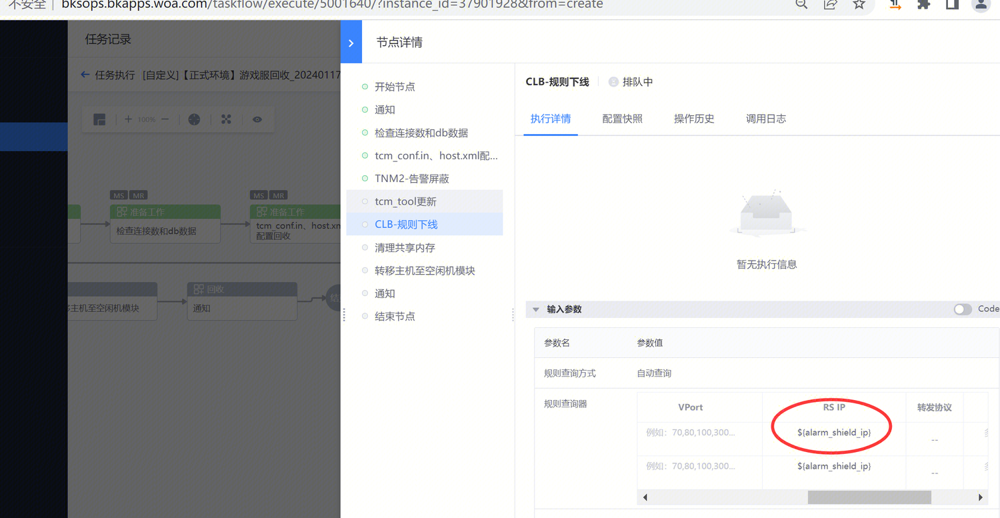
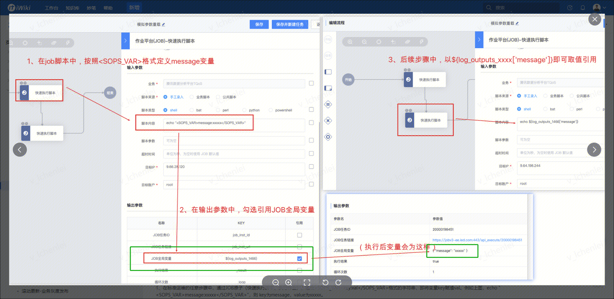

## 现象描述：

用户描述：确认下，这里的变量，是要执行这步才会替换成实际ip?  

 

## 问题定位及处理：

这个是得执行到对应的节点才会渲染成实际的值，可以参考看 下图

   

####   
####   
####   
#### 易事厅单据链接：

[https://zhiyan.woa.com/servicedesk/detail/2714961?proj_id=27&module=14](https://zhiyan.woa.com/servicedesk/detail/2714961?proj_id=27&module=14)  

  

如果文档内容对您有帮助，请”点赞“；若没解决问题，请在评论区留言。