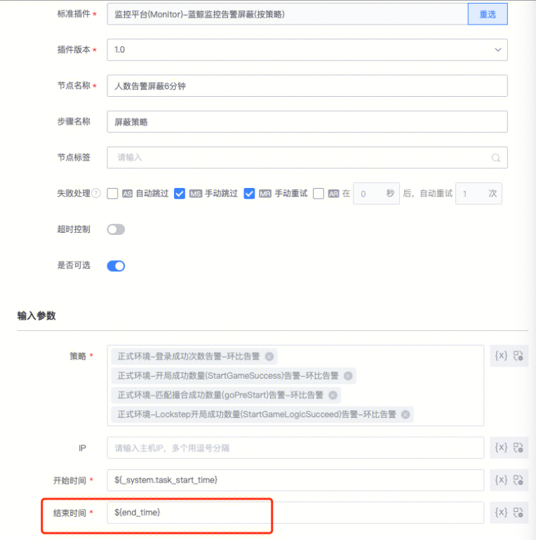

## 现象描述：

结束时间如何设置未来十分钟

## 问题定位及处理：

参照这个格式，这个配置的是获取后边步骤的定时时间，自动减30分钟作为定时时间

${(datetime.datetime.strptime(timing, "%Y-%m-%d %H:%M:%S") - datetime.timedelta(hours=0.5)).strftime("%Y-%m-%d %H:%M:%S")}
 
  

如果文档内容对您有帮助，请”点赞“；若没解决问题，请在评论区留言。