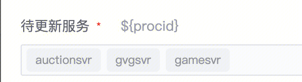
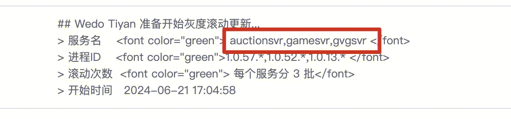
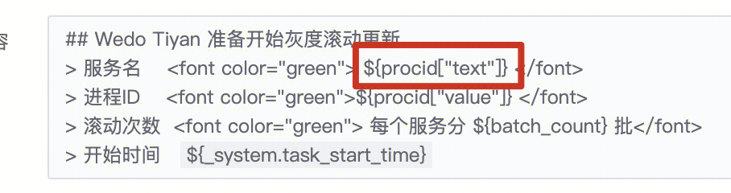

## 问题描述：

下拉文本框变量 text 取出来的值和实际填的值顺序对不上，value取出来顺序是对的

 

 

 

## 问题原因：

目前的实现没有保证这个顺序

## 解决方法：

已提issue后续对应会合理，目前是拿着所有的选项去匹配选中的值，应该用选中的值去匹配选项更合理些

##   
## 易事厅链接：

[https://zhiyan.woa.com/servicedesk/detail/2718972?proj_id=27&module=14](https://zhiyan.woa.com/servicedesk/detail/2718972?proj_id=27&module=14)