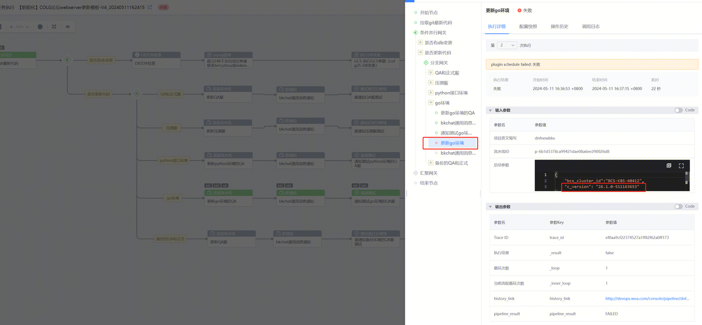
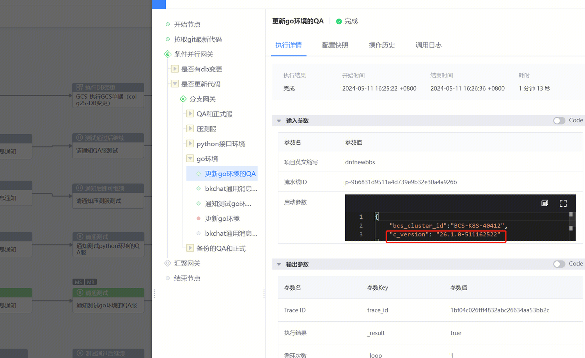
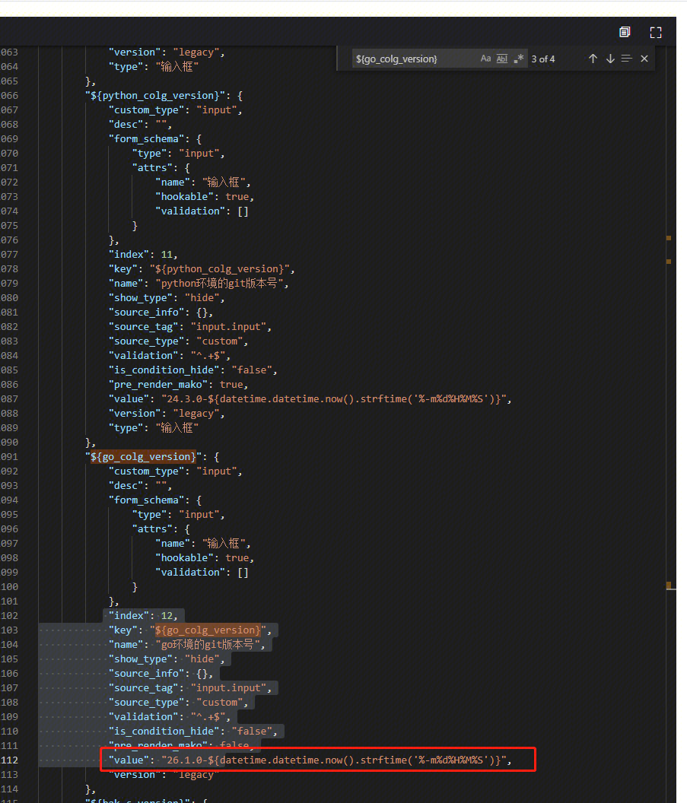
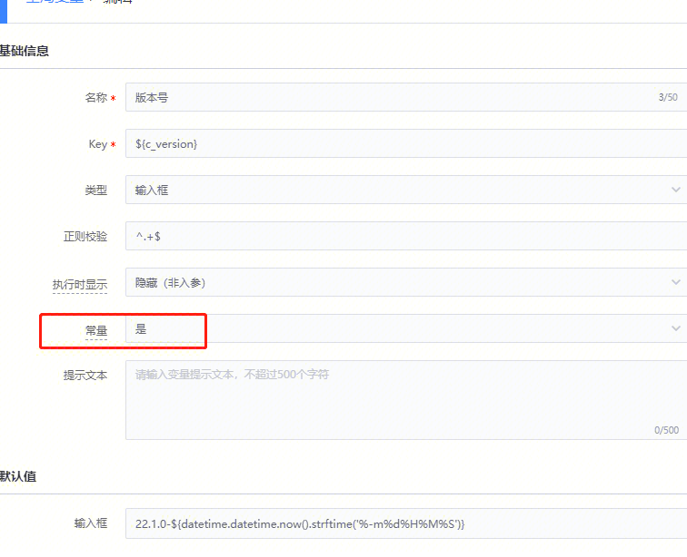

## 现象描述：

   
[https://bksops.bkapps.woa.com/function/execute/5000102/?instance_id=49329354](https://bksops.bkapps.woa.com/function/execute/5000102/?instance_id=49329354)流程引用的同一个变量，值不同

## 问题定位及处理：

  

 原因是value的生成加了时间，如果希望不是变化的值就要改为常量，设置为常量后 只会在创建任务那一刻渲染一次 就不再渲染了
 

   

####   
####   
####   
#### 易事厅单据链接：

[https://zhiyan.woa.com/servicedesk/detail/2717644?proj_id=27&module=14](https://zhiyan.woa.com/servicedesk/detail/2717644?proj_id=27&module=14)  

  

如果文档内容对您有帮助，请”点赞“；若没解决问题，请在评论区留言。