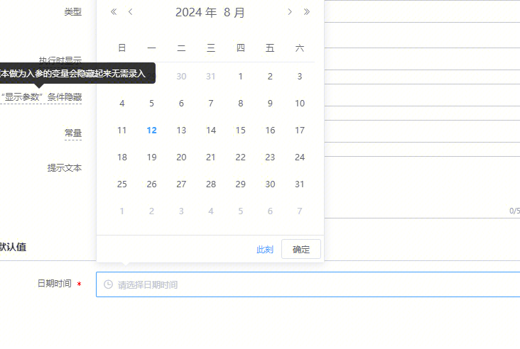
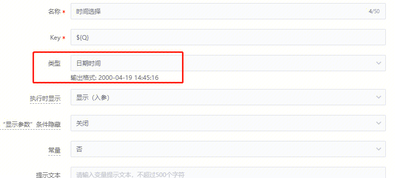
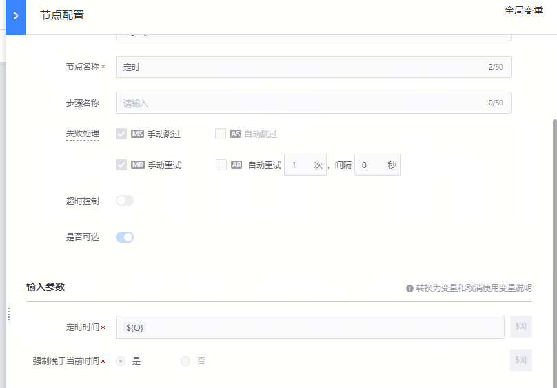

## 问题描述：

 

想改成下图的类型

## 解决方法：

可以新建一个全局变量类型选日期时间!

 

然后再节点配置里引用这个变量就可以

 

##   
## 易事厅链接：

[https://zhiyan.woa.com/servicedesk/chat/chatQuery?proj_id=27&session_id=1822893756689588224&show_detail=1](https://zhiyan.woa.com/servicedesk/chat/chatQuery?proj_id=27&session_id=1822893756689588224&show_detail=1)