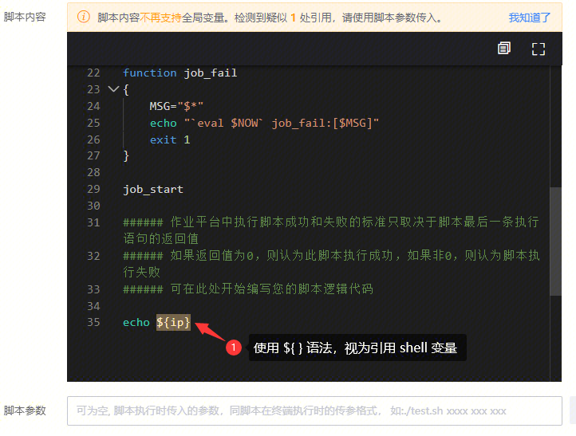
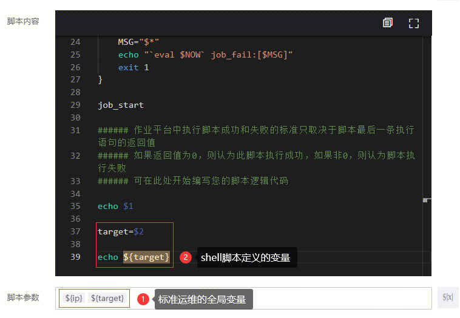

### 是的。从 V3.31 版本开始，我们对 快速执行脚本 插件进行了优化

1. 新添加的"快速执行脚本"节点，不支持 脚本内容直接使用 ${ } 语法引用全局变量

2. 已有"快速执行脚本"节点，脚本内容 未使用 ${ } 语法引用全局变量，不支持 脚本内容直接使用 ${ } 语法引用全局变量

3. 已有"快速执行脚本"节点，脚本内容 有使用 ${ } 语法引用全局变量，则 仍然支持使用 ${ } 语法引用全局变量，但建议修改为使用脚本参数传递

### 原因：

1. 脚本里一旦使用全局变量，则脚本将仅在标准运维可用，无法复制到其它场景直接复用
2. 脚本里即使未使用全局变量，但因为都使用了 ${ } 引用语法，当新增的全局变量恰好和 shell 变量命名一致，则可能导致脚本运行不符合预期
3. shell脚本的 ${#var}、${var=default} 等变量扩展语法不可用

### 解决方案：使用脚本参数传递全局变量，脚本中使用 $1 、$2 接收入参

### 注意：

1. 多个脚本参数，请以空格分割
2. 参数值如含有空格、换行等空白符，请以 "" 包裹  

