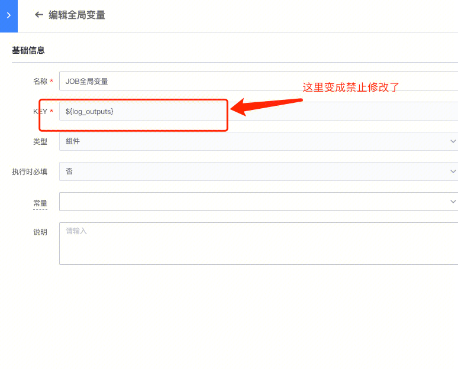

## 现象描述：

把作业平台节点的输出，作为一个全局变量进行输出，然后给其他节点使用，自定义修改变量名称

## 问题定位及处理：

##### 原因分析:

1、${log_outputs} 组件变量的key一直是不能修改的。如果有设置第二个同名的组件变量的话，会提示修改key。保存后就不能修改了

2、这个当前不支持。之前很多同学反馈把插件字段设置为变量太麻烦了。所以我们改成了默认帮用户自动设置变量名了，如果定义多个同名变量时，才会让用户去自定义变量名。这个我们后续再优化下。

##### 处理方法:

可以先创建一个log_output全局变量。 然后在这个节点上再设置为全局变量的时候，就会引起同名变量修改。。这时候就可以将节点上的变量设置为我自己的变量名了

####   
####   
#### 易事厅单据链接：

如果文档内容对您有帮助，请”点赞“；若没解决问题，请在评论区留言。