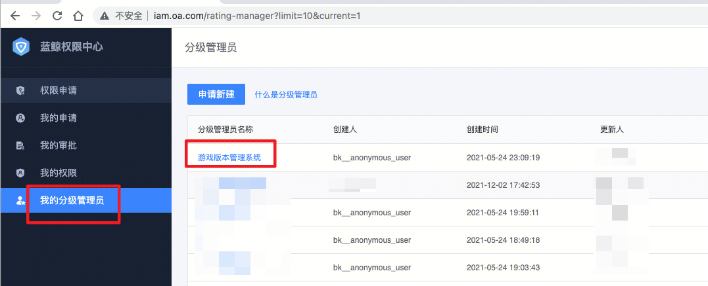
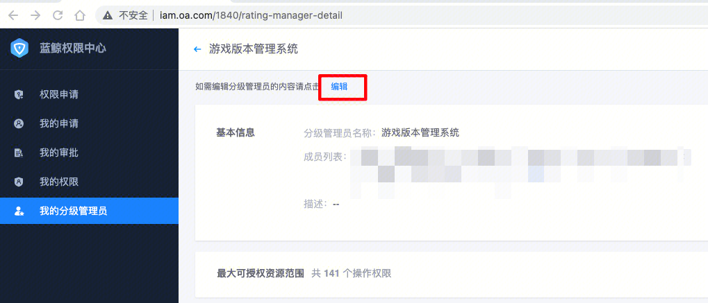
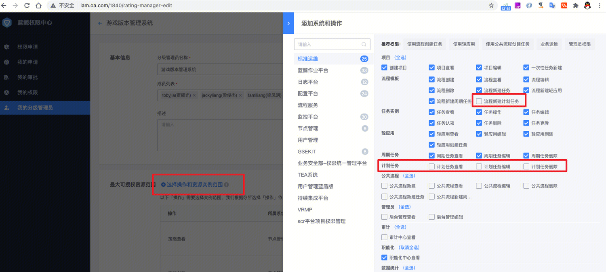
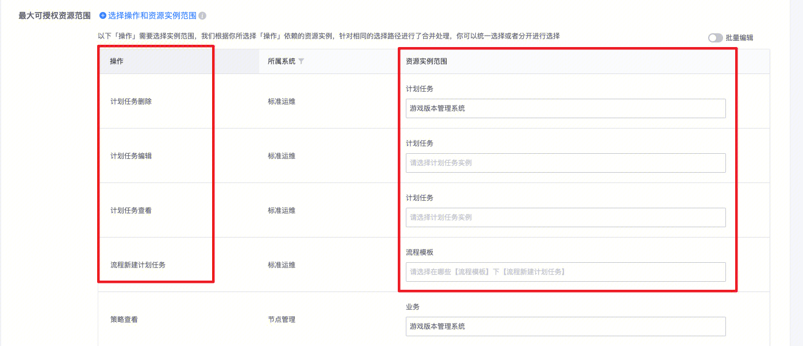
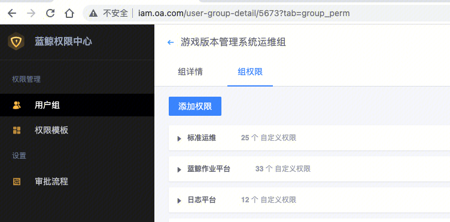
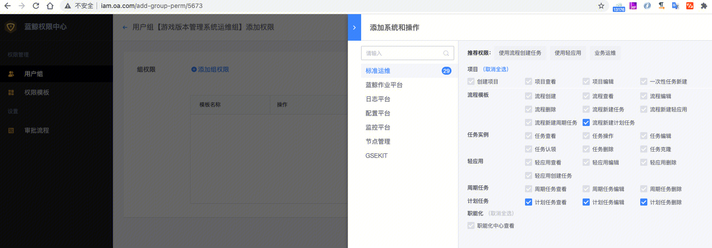
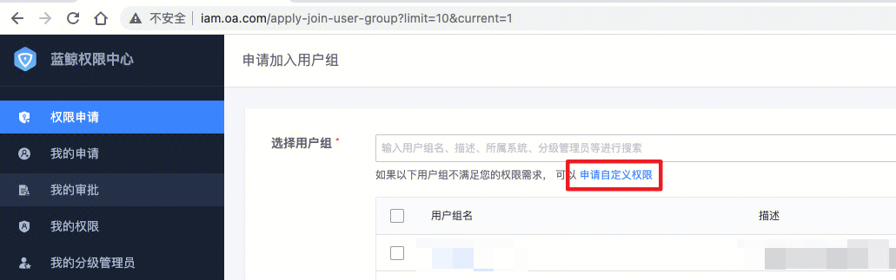
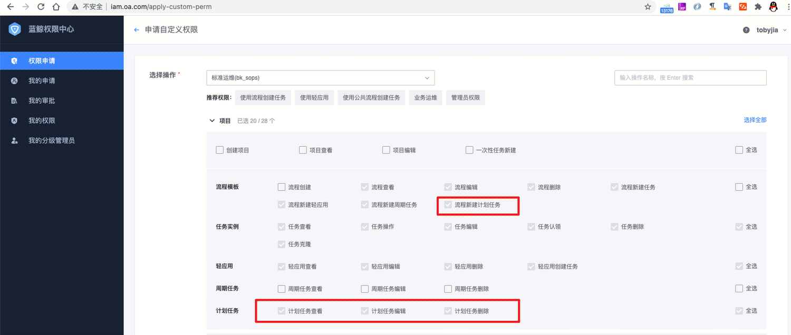

计划任务功能，是标准运维新增的功能。默认没有包含在业务权限组中，需要分级管理员添加、或者请用户自行申请。

ps ： 目前iam正在研究批量刷新到历史已经创建的权限组里，后续会有方案进行批量添加。

所有新增权限的需求，均可参考这个文档进行。

##  一、业务运维负责人：进行业务级别的权限调整（推荐）

如果你是业务的运维负责人，可以进行业务级别的权限调整，整体管理。新增包含两部分：

### 1、分级管理员角色的权限调整

分级管理员角色是一种admin身份，他可以管理权限组，但不拥有该业务的授权实例。业务首次创建时，蓝鲸给每个业务均创建了分级管理员角色，角色名即为业务名。

分级管理员角色划定了三块内容：

（1）成员列表：拥有分级管理员角色的成员列表（业务运维负责人，默认有该业务的分级管理员角色。）

（2）最大可授权资源范围：在权限组中，最大可管理蓝鲸各个系统的权限项目的范围

（3）最大可授权人员：在权限组中，最大可管理的人员范围

分级管理员的修改，需要蓝鲸系统管理员审批。

标准运维新增了“计划任务”的功能，对应着，在iam权限中心里，也对应的新增了“计划任务”功能想对应的权限。

所以我们要调整分级管理员的“最大可授权资源范围”，以便我们分级管理员，可以增加管控上这些权限。步骤为：

(1) 登录权限中心[ http://iam.oa.com](http://iam.oa.com) ，在普通用户身份下，点击“我的分级管理员”（左边banner）栏目，点击你要调整的分级管理员名字。

(2) 在分级管理员的查看页面，可以看到目前的”成员列表“、”最大可授权资源范围“和”最大可授权人员“三大块信息。

点击”编辑按钮“进入编辑模式 ：

（3）点击”最大可授权资源范围“ 右侧的” 选择操作和资源实例范围“

在 弹出的权限选择框中，选择”计划任务“功能新增的这四项权限：流程新建计划任务、计划任务查看、计划任务编辑、计划任务删除。

（4）确定后，选择这四项新的操作的”资源实例范围“，为你的业务。

（5）保存后，可以看到权限申请单。可以复制url，找蓝鲸管理员tobyjia优先审批。

## 2、权限组的调整：

权限组是由管理员创建和管理的、真正的授权实例。用户申请加入权限组、权限组的人员修改、权限项目修改等权限组的操作，不需要蓝鲸系统管理员审批，交由分级管理员审批和管理。

业务接入时，蓝鲸系统在该分级管理员角色下，创建了”xxx业务运维组”和“xxx业务查看组”，分别对应“运维权限”（能够运维蓝鲸各个平台的该业务）和“查看权限”（仅能够查看蓝鲸各个平台的该业务），简化分级管理员的权限管理难度。

权限组包含两块内容：

（1）组成员：即授权人员。

（2）组权限：实际授权的内容。组权限可以通过权限模板、或自定义权限组合。

ps：权限模板：单一平台的多个权限集合，可以保存为一个模板，供多个权限组复用引用。

通过步骤1分级管理员角色的调整后，分级管理员可以给“运维组“的权限组，增加这四个权限了。

（1）登录权限中心[ http://iam.oa.com](http://iam.oa.com) ，右上角登录名那里，点击，选择分级管理员的名字（即业务名），切换到该分级管理员角色的配置页面，此时界面颜色会变成金色图标，以示区分。

（2）在左侧，点击用户组栏目，找到xxx业务运维组，点击名字，进入运维组编辑页面。点击组权限，在此添加权限。

（3）点击添加权限、添加自定义权限后，可以看到这四项权限了。请你勾上、确定后，依然在四项新的操作的”资源实例范围“，为你的业务。保存后，该权限组的所有人员均可以使用”计划任务“功能了。

## 二、普通用户：申请自定义权限

如果你是普通用户，非业务的运维负责人，如果需要使用标准运维的新功能——计划任务。

可以寻找业务运维负责人，请他按照"一、业务运维负责人：进行业务级别的权限调整（推荐）"的步骤，请他更新分级管理员、以及对应权限组，增加对应权限。

或者申请自定义权限，交由leader审批、蓝鲸系统管理员审批。

标准运维 ”计划任务“功能，完整使用，需要新增四项权限：流程新建计划任务、计划任务查看、计划任务编辑、计划任务删除。

（1）登录权限中心[ http://iam.oa.com](http://iam.oa.com) ，选择权限申请-申请自定义权限。

（2）选择操作：标准运维(bk_sops)，在项目这一类中，可以找到这四项权限，选择你需要使用的权限。并在下方关联资源实例中，新增的权限里面，选择资源实例为你的业务。提交保存。

（3）此时会生成权限申请单，点击进去可以看到单据详情，请leader审批、蓝鲸管理员审批后，拥有对应权限。

