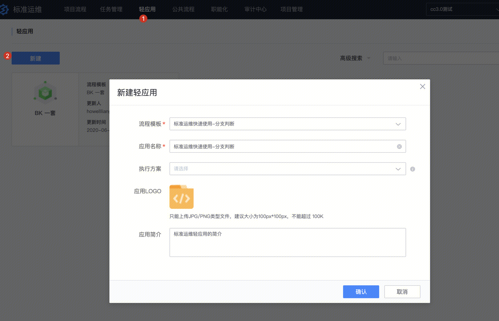
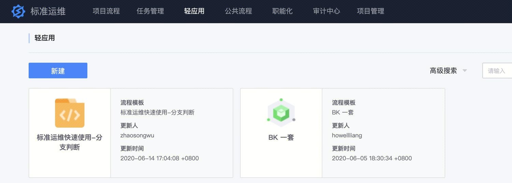
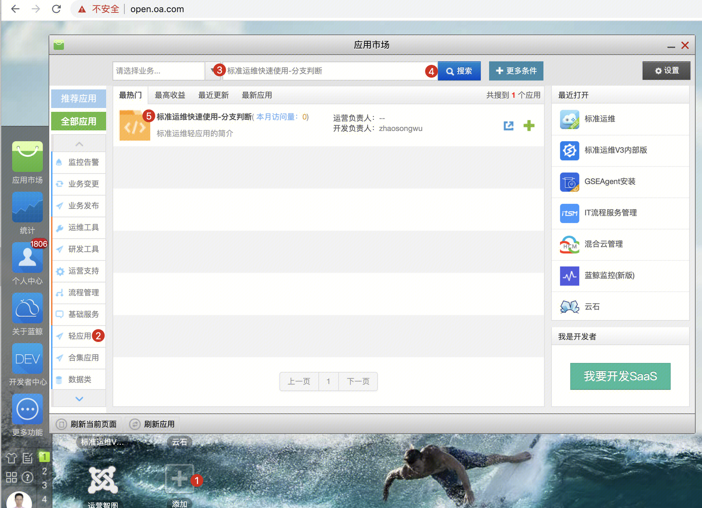
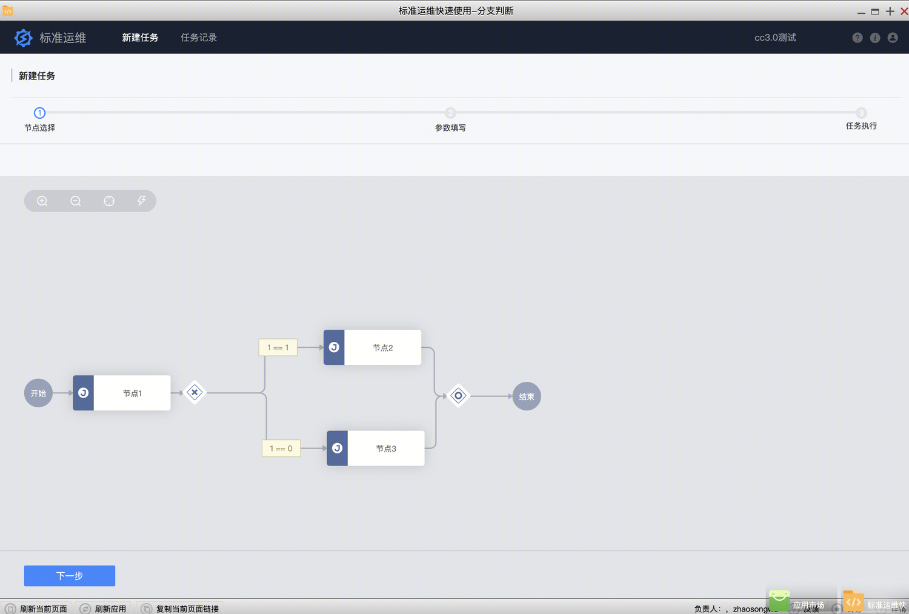

# 轻应用是什么

业务运维人员将日常工作标准化后，以标准运维中一个模板的形式提供给业务非技术人员使用，为了降低使用者的操作风险和使用成本，将该模板以独立 SaaS 应用的方式指定给授权者使用，这种不需要开发、零成本快速生成的 SaaS 应用称为 "轻应用" 。

# 创建轻应用

 标准运维->轻应用->新建

# 使用轻应用

在轻应用页面，用户可以根据一个已执行完成的任务创建一个轻应用到指定用户的蓝鲸桌面。

