> 在业务层，轻应用一般是给非运维角色（测试、开发、产品等）使用，因JOB权限比较敏感一般情况都是不让申请job权限的  
> 在这里增加标准运维中以运维身份执行轻应用的权限配置方法

## 一、申请使用轻应用权限

使用轻应用需要有以下几个权限：

**项目查看、流程查看、轻应用查看、轻应用创建任务**

权限管理有两种方式：

### 方法一：分级管理员自行配置权限组 【推荐】

蓝鲸权限中心([iam.oa.com](http://iam.oa.com))，在每个业务创建的时候，给运维规划、运维人员创建了分级管理员角色，分级管理员可以自行管理该业务下的各蓝鲸系统权限。

改方案为推荐方案。用户无需申请或者审批，分级管理员直接进行配置即可授权。

【配置步骤】

1、请这个业务的运维人员访问权限中心([iam.oa.com](http://iam.oa.com))，点击右上角姓名框，选择你业务对应名称，进入到分级管理员配置页面。

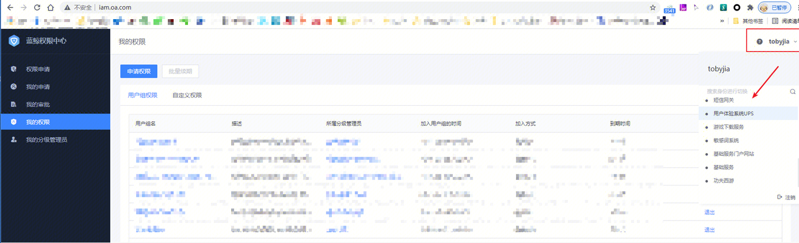

进入分级管理员的权限配置页面后，页面图标和文字会变成金色，以示区分。

2、在左上角的用户组页面，新建用户组，该用户组就专门用于处理某一类的事情而集中管理，例如新建一个“TQOS业务轻应用人员组”。

蓝鲸系统默认给每个业务，创建了两个权限组：“xx业务查看组”和“xx业务运维组”，分别对应着大权限和小权限，分级管理员可以自行添加人员进去赋权。

如果需要为特定的用途单独赋权（如本文中，仅需要为某些人开通某些轻应用的权限）则请“新建权限组”，专门管理这组权限及人员。

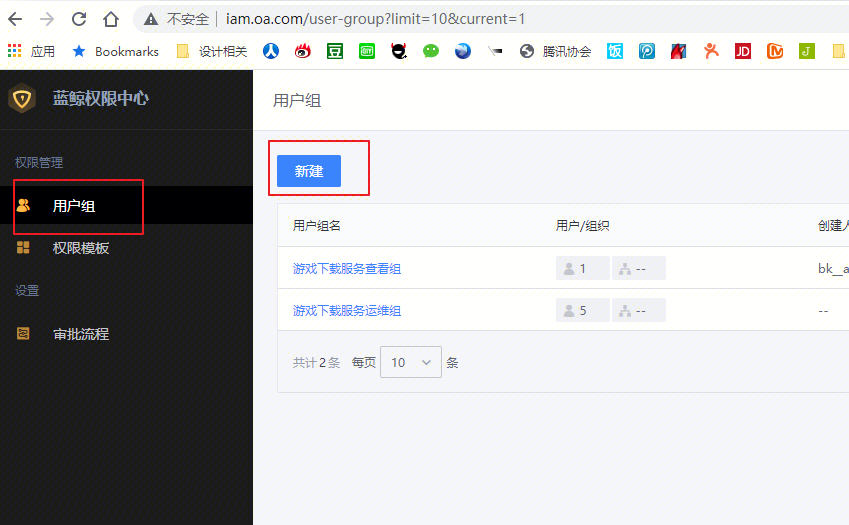

3、在弹出的页面中，选择“添加自定义权限”。

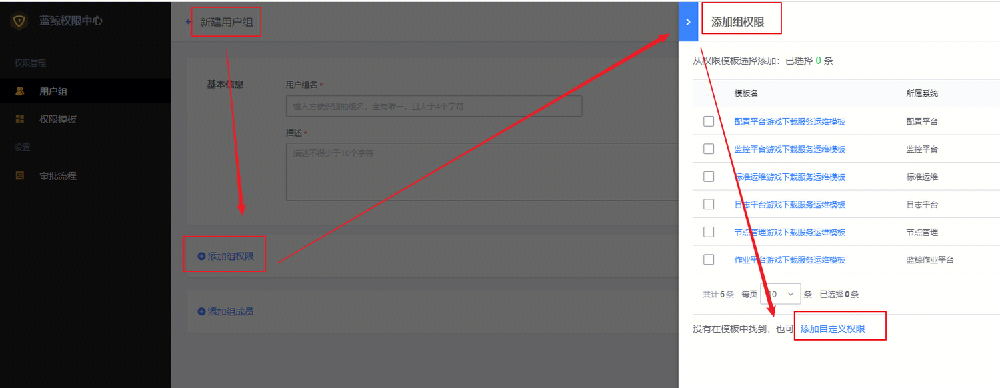

4、选择标准标准运维，添加轻应用需要的四项权限：**项目查看、流程查看、轻应用查看、轻应用创建任务**

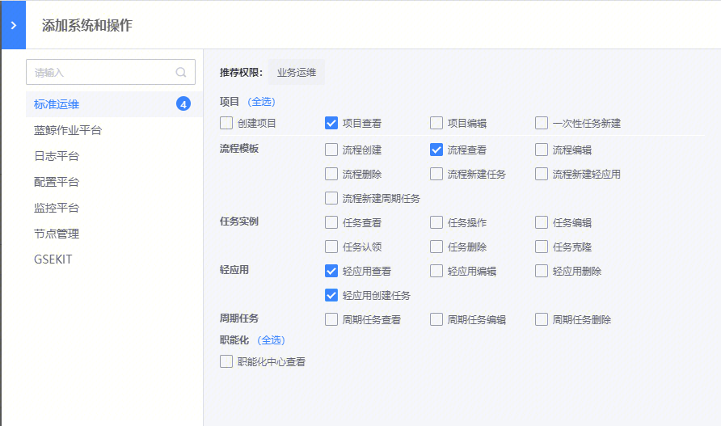

5、确定后，在组权限页面，配置具体要赋权开通权限的轻应用条目。（如图可以精细到单一条目）

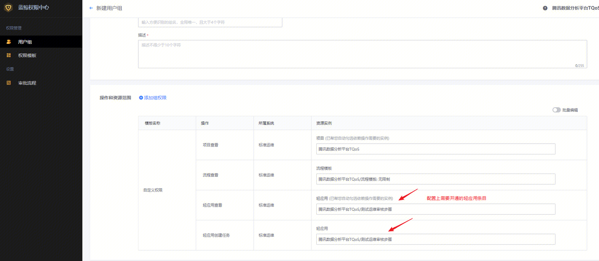

6、在添加组成员的地方，给需要执行请引用的人员赋权。

7、该权限组保存后，权限生效。分级管理员可以自行随时修改、新增、删除权限条目和授权人员，无需删除。

用户也可以直接申请加入该用户组，分级管理员审批后，亦可加入。

### 方法二：申请自定义权限，待蓝鲸系统管理员审批。

申请自定义权限的方式，需要由蓝鲸管理员审批的流程，不做推荐。

【申请自定义权限】

1. 访问权限中心([iam.oa.com](http://iam.oa.com)) → 权限申请 → 申请自定义权限

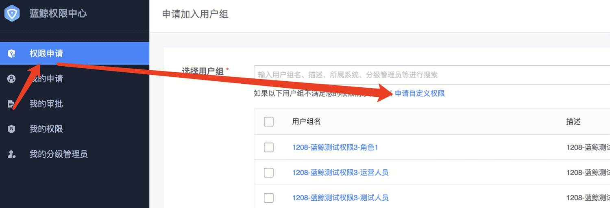

2. 选择标准运维系统，在推荐权限里，点击**使用轻应用**。或人工勾选上执行轻应用需要的四项权限：**项目查看、流程查看、轻应用查看、轻应用创建任务**

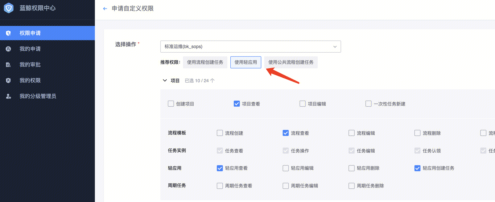

3.选择相关资源实例，选择完成并提交，审批通过后，即可查看标准运维轻应用

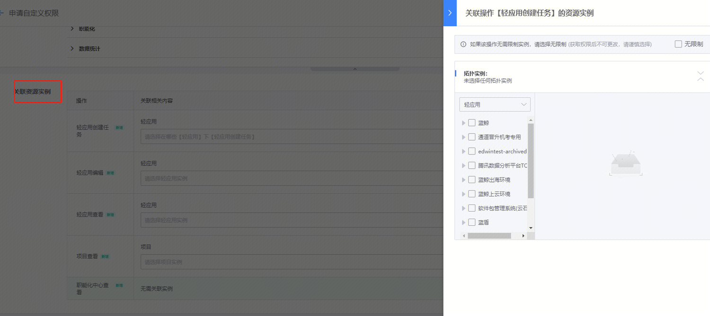

## 二、配置“以运维身份执行”功能：

标准运维的插件，实际是调用周边系统接口，从而触发该项功能，实现功能。通常情况下，运维人员才会有周边系统的权限，其他角色没有权限。

所以，需要将该业务配置“以某位运维的身份去执行“的功能，才能使得执行人以这位”有周边系统权限的运维人员“的身份，去正常执行。

该功能有两种方式进行配置：配置单流程的执行代理人、配置全业务流程的执行代理人。

### 方法一：配置单流程的执行代理人

若只需要对某个单一流程，配置执行代理人，则使用该方法。该方法不会对其他流程生效。

【配置方法】

进入该轻应用流程的编辑页面，在基础信息的编辑页面，配置执行代理人名单。

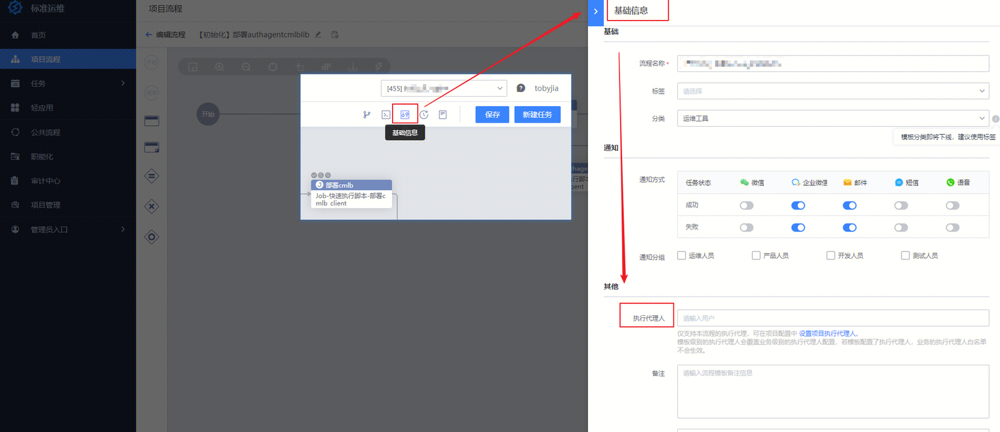

### 方法二：配置全业务所有流程的执行代理人

若需要对业务全部流程，配置执行代理人，使得所有流程模板执行时，均以该代理人身份调用第三方接口，则使用该方法。

配置位置：项目管理--找到相应业务--项目配置，添加下执行人信息。

标准运维中的“项目管理-项目配置”页面的权限，默认没有开通，请自行在iam.oa.com中，申请自定义权限，开通“项目编辑”的权限。

配置项说明：

（1）执行人：执行人名字，只能写一个。用于其他人员执行任务时，任务以“执行人”身份执行。

（2）排除执行人名单：排除人名单，可以写多个。名单中的用户，不以”执行人“的身份执行，而是以自己名字的身份执行。用于同业务的其他运维人员。

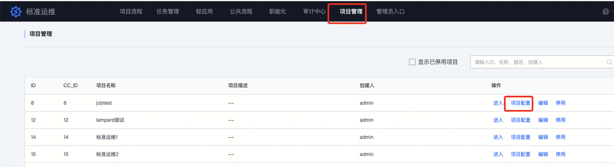

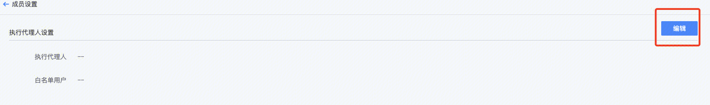

### 举例说明

配置项如为：

执行人： A

排除执行人名单：B

当B执行任务时，任务实际执行人是B；当C执行任务时，任务实际执行人是A。

