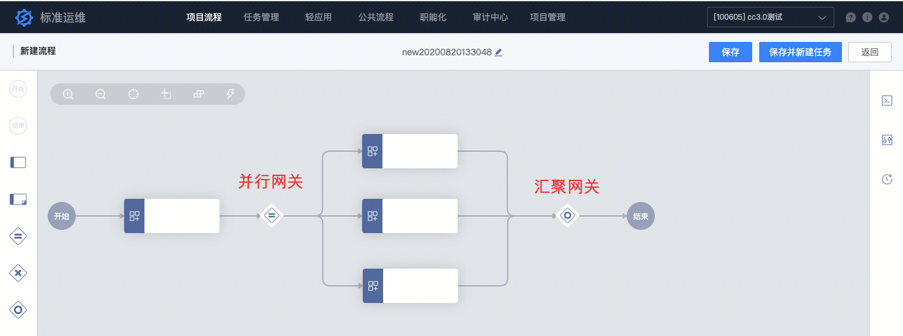
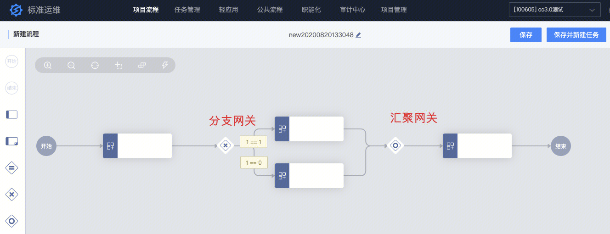
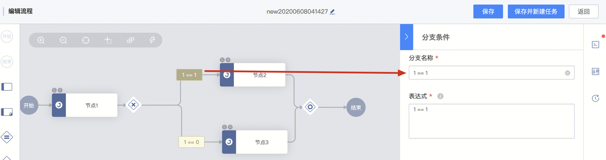
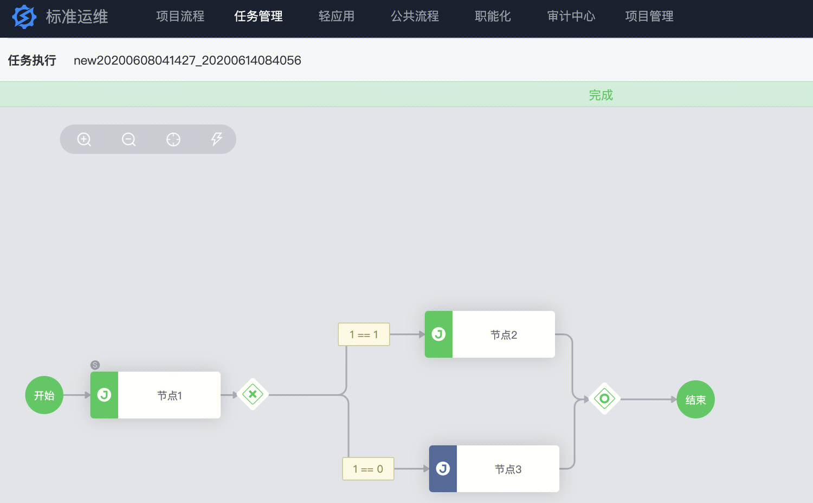
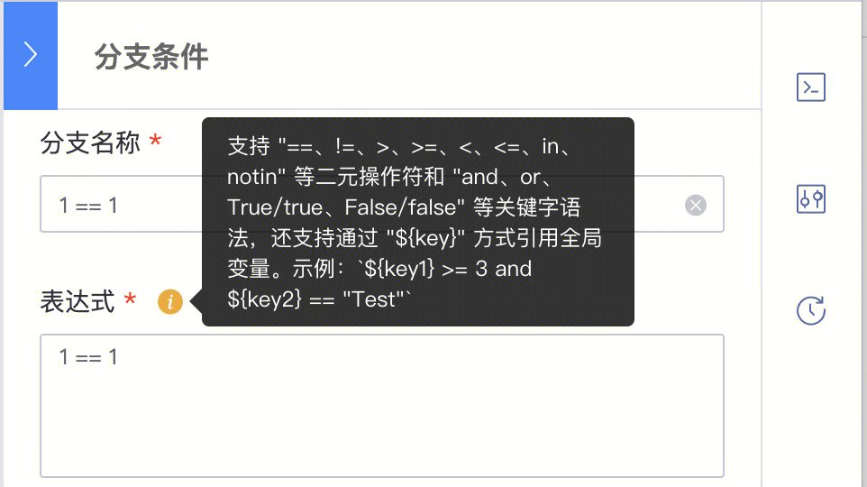

[TOC]

# 概述

标准运维提供了并行网关、分支网关和汇聚网关的原子，供实现并行执行、分支判断的功能。

详细实际举例，请参阅：[使用流程分支、判断功能，实现针对不同服务器进行操作的案例](https://iwiki.woa.com/p/194043637)

## 1、并行网关

如下图示意：并行网关，可以并发实行多个步骤。

## 2、分支网关

如下图示意：分支网关、搭配分支条件，可以实现分支判断的功能。

# 分支条件的默认表达式   

    当创建一个分支判断的时候，默认的表达式为1 == 1,这是分支网关创建的默认示例表达式，请修改为实际需要的表达式，流程会默认执行**节点2**，请注意，只要**节点1**执行通过后，则不会执行**节点3，这里的1 == 1 以及 1 == 0 ，仅仅是分支网关的示例。**

# 分支判断表达式

分支表达式是一段符合 **Python 语法**的简单代码，**是二元操作符和关键字组成的表达式**。

# 分支执行的逻辑

-       **执行到分支网关节点时，标准运维执行引擎分别计算每个分支表达式的结果，得出为 True 或者 False**。
-       **如果有多个分支条件为 True，执行分支会根据判定顺序，执行第一个结果为 True 的分支**，所以**/请不要设置多个分支的条件存在并集或者多个分支条件一样/**。

      如分支 1: ${v1} > 2 分支 2: ${v1} > 1 分支 3: ${v1} <= 1，可以改为 分支 1: ${v1} > 2 分支 2: ${v1} > 1 and ${v1} <= 2 分支 3: ${v1} <= 1

-        **如果所有分支判定为 False，则分支网关执行报错**。
-        **分支网关出错后需要人工介入，手动指定执行分支，选项是各分支的条件表达式，所以请不要设置多个分支的条件表达式一样，否则出错后无法区分需要执行的分支**

# 分支表达式的语法

二元操作符语法和使用示例参考下面的表格

| **二元操作符** | **含义** | **示例** |
| - | - | - |
| **==** | 等于 | ${v1} == 1   1 == True |
| **!=** | 不等于 | ${v1} != 1   0 != True |
| **>** | 大于 | ${v1} > 1 |
| **<** | 小于 | ${v1} < 1 |
| **>=** | 大于等于 | ${v1} >= 1 |
| **<=** | 小于等于 | ${v1} <= 1 |
| **in** | 包含于 | ${v1} in (1, 2) |
| **not in** | 不包含于 | ${v1} notin (1, 2) |

关键字语法和使用示例参考下面的表格

| **关键字** | **含义** | **示例** |
| - | - | - |
| **and** | 且 | ${v1} == 1 and ${v2} == 2 |
| **or** | 或 | ${v1} == 1 or ${v2} == 2 |
| **True**   **true** | 真 | ${v1} == True   ${v1} == true |
| **False**   **false** | 假 | ${v1} == False   ${v1} == false |

**分支表达式**也可以通过 ${key} 方式**引用全局变量**，如: **${v1} == '1' 'test' in ${v1}**

